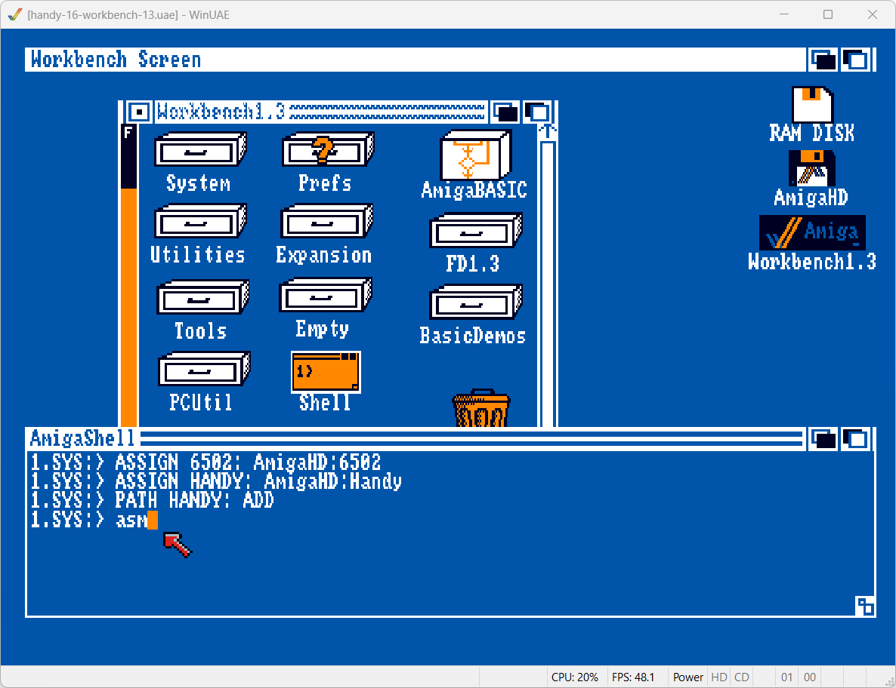
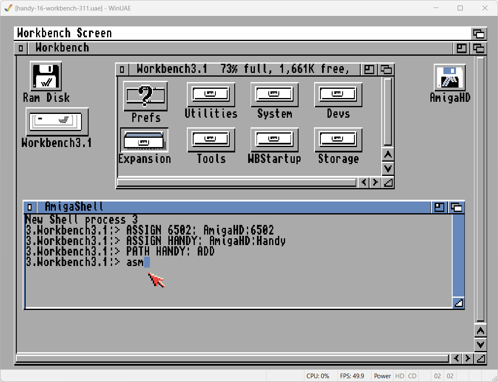

# handy-amiga

This repository contains Amiga diskettes and hardfiles for WinUAE to run an emulated Handy development environment, also known as Lynx Development System.

**Currently only revision 1.6 (25th September 1991) is available.**

The Handy development environment requires the following:
- [WinUAE](https://www.winuae.net/download/) or [FS-UAE](https://fs-uae.net/download) emulator
- Kickstart ROM
- Workbench installation
- Quarterback backup software (optional)

Cloanto software offers [Amiga Forever](https://www.amigaforever.com/) software that provides various versions of Kickstart ROMs and Workbench hardfiles for nearly every Amiga system. It is a legal way to acquire the files needed to work with an emulated Amiga environment.

## Diskettes for Lynx Development System

The folder `adf` contains 8 diskette images in Amiga Disk File format.
- `handy-16-boo.adf`: Boot disk to use when booting from floppy disk instead of harddrive
- `handy-16-hd0.adf`: Quarterback 4.3 backup of hard drive 0.
- `handy-16-disk*.adf`: Backup set of Amiga development hard drive, consisting of 6 parts. Requires Quarterback 4.3 or 5.0 to restore.

The Handy boot disk can be used to boot directly from floppy disk on Amiga computers that do not have a hard drive.

Using the remaining disks requires the installation of the Quarterback program version 4.3 or 5.0. For your convenience the two backup sets have been restored into the two hardfiles listed in the `hdf` folder.  

## Hardfiles with restored backups

The folder `hdf` contains two hardfiles for Amiga hard disks. These disk are not bootable. Instead, mount these disks as additional drives.

- `HandyDH0.hdf`: 1 MB hardfile with restored backup of set on `HandyDH0.adf` 
- `HandyAmigaHD`:  
   8 MB hardfile with restored backup of Lynx Development System on set of disks `HandyDisk1.adf` to `HandyDisk6.adf`.
