# Commodore A590 controller setup guide

This guide describes how to setup a hard disk for the Amiga A590 controller. It uses the WinUAE emulator, but can be done with actual hardware as well. The actual hard disk layout can be chosen. The hard disk and its partitions will be used for the Epyx Handy development kit.

Requirements:

- WinUAE emulator (or actual hardware)
- Kickstart 1.3 ROM (`amiga-os-130.rom`)
- A590 controller boot ROM (`amiga-boot-a590.rom`)
- A590 Setup disk ([download](https://amiga.resource.cx/exp/a590) and extract from `dms` to `adf` using `xdms`)

Create a standard Commodore Amiga 500 configuration in WinUAE. You can start with the default `A500` configuration under `Settings > Quickstarts` and click `Set Configuration`.

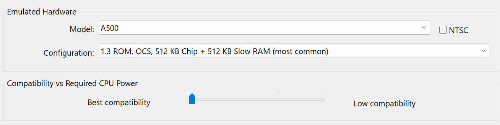

This guide is about the A590 controller which needs to be added under `Settings > Expansions`. Select `SCSI controllers` in the section for expansion board settings. From the dropdown for the controller, find and select the `A590/A2091 (Commodore)`. Set the SCSI controller ID to `1` and switch to `DMAC-02`. Also, click on the ellipsis `...` button to navigate to the A590 boot ROM file `amiga-boot-a590.rom`. 

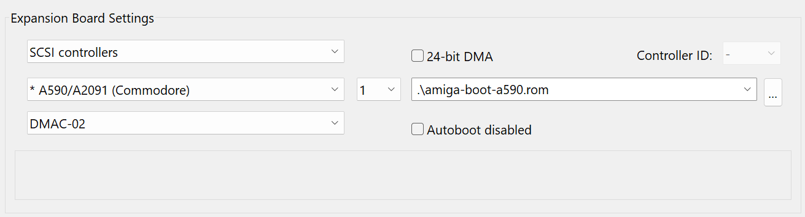

Next, at the `Settings > Hardware > CD & hard drives` section of the configuration click `Add Hardfile...`. 

In this setup a Seagate ST251 drive of 40 MB will be used. The characteristics of this drive 

|Drive property|ST251|ST225|
|---|---|---|
|Surfaces|6|4|
|Sectors|17|17|
|Cylinders|820|615|
|Block size|512|512|
|Hardfile size (bytes)|42.823.680|21.411.840|
|Hardfile size (MB)|41|21|
42.811.392
You can choose any hard drive type you want to use. Be sure to enter the minimal hardfile size in megabyte and corresponding geometry. The rest of this setup assumes the ST251 drive.

In the next dialog add a 41 MB hardfile at the bottom and click `Create`.

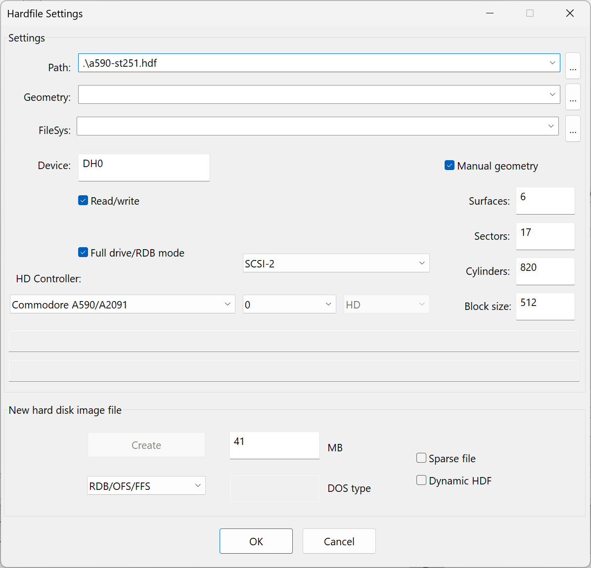

Save the file as `a590-st251.hdf` indicating it purpose for the 40MB ST251 disk for the A590 controller. Name the device `DH0` as it will be our primary drive and check the `Full drive/RDB mode`, as the A590 offered support for Rigid Disk Blocks (RDB) with Kickstart 1.3. Add a manual geometry with the ST251 geometry parameters from above.

Under `HD Controller`select the `Commodore A590/A2091` controller you created earlier. Also, choose ID `0` for this controller if necessary.

Click `OK` to complete the dialog and return to the main configuration screen and save the configuration as `epyx-handy-16-amiga500-a590.uae`.

## Setting up hard disk layout and partition

Insert the A590 Setup diskette `a590-setup.adf` into `DF0` as read/write enabled and start the emulator.

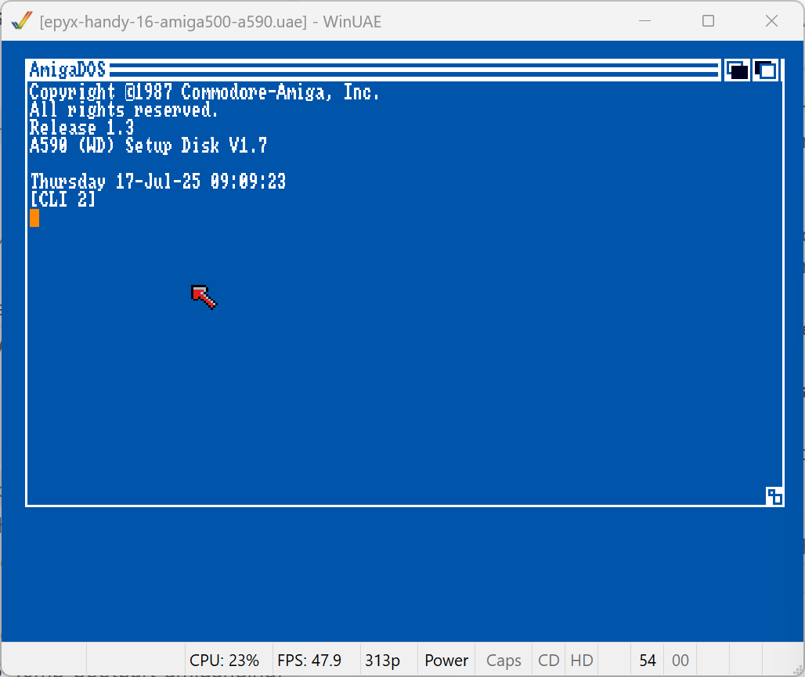

After booting the screen open the `A590 Setup` drawer.

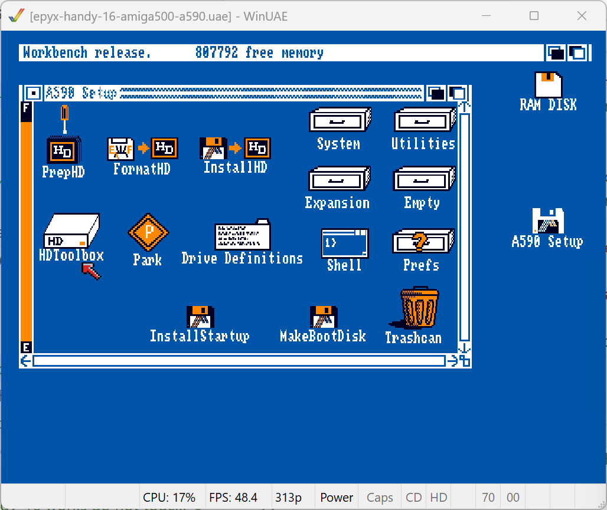

Start the HDToolbox utility and notice how it will enumerate several devices during startup. Afterwards, the main window should list a SCSI interface with `Unknown` status. 

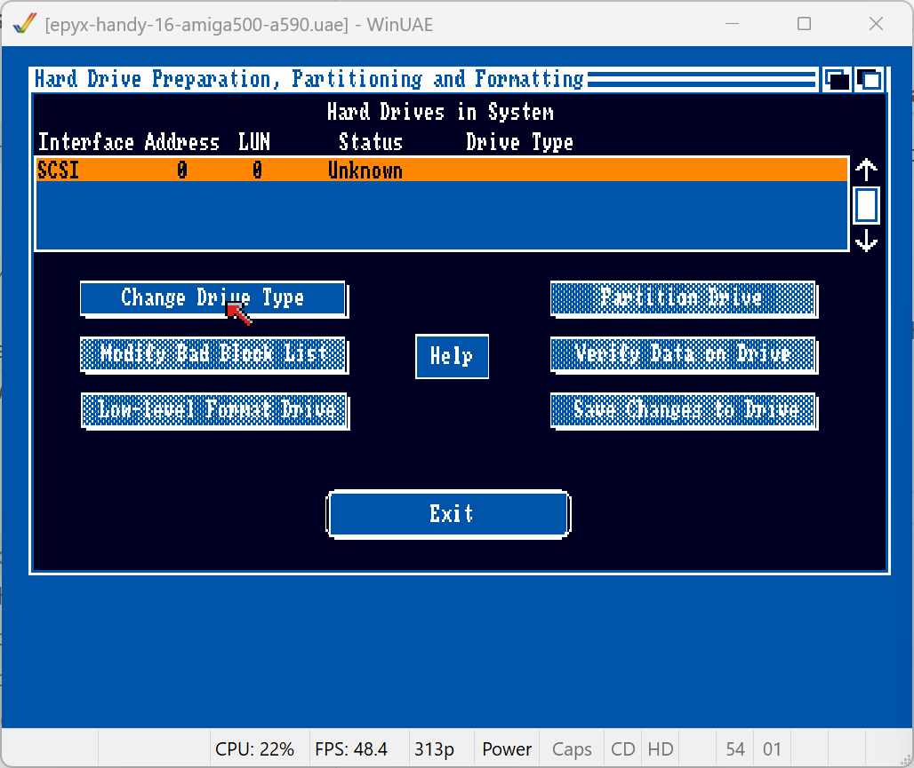

If not, retrace your steps and verify that the A590/A2091 controller was selected.

Click on `Change Drive Type` and find the list of types stored in the `Drive Definitions` file, listed in the two tabs `SCSI` and `XT`. There might already be drive types listed. 

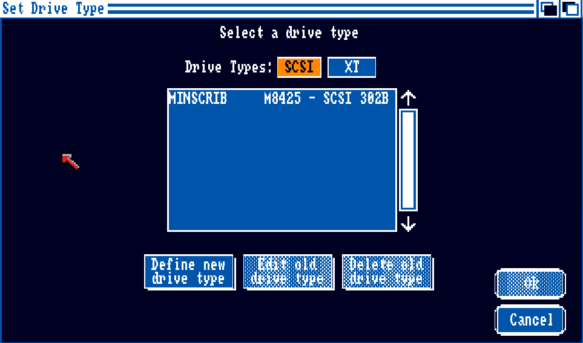

Create a new drive type by clicking `Define new drive type`. In the next dialog fill in the details for the drive. 

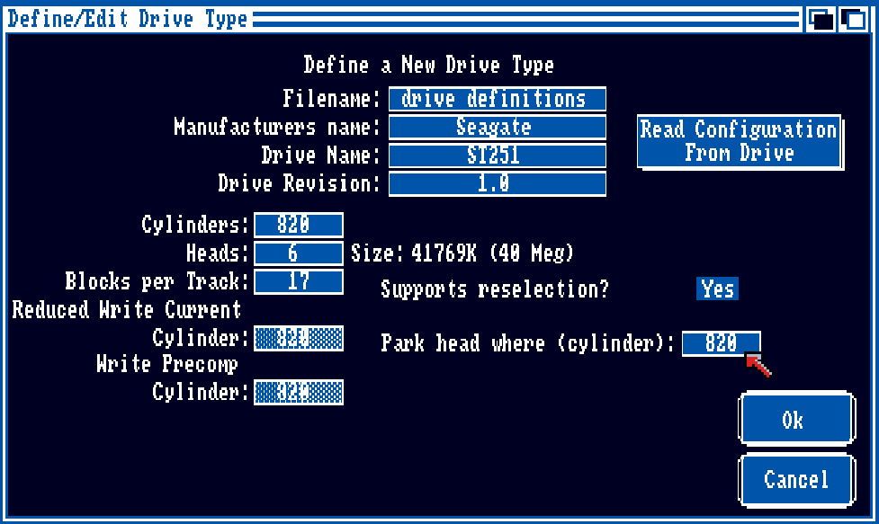

|Property|Value|
|---|---|
|Manufacturers name|Seagate|
|Drive Name|ST251|
|Drive Revision|1.0|
|Cylinders|820|
|Heads|6|
|Blocks Per Track|17|
|Park head where (cylinder)|820|

Click `Ok` to save this drive type to the floppy diskette (which should be writable).

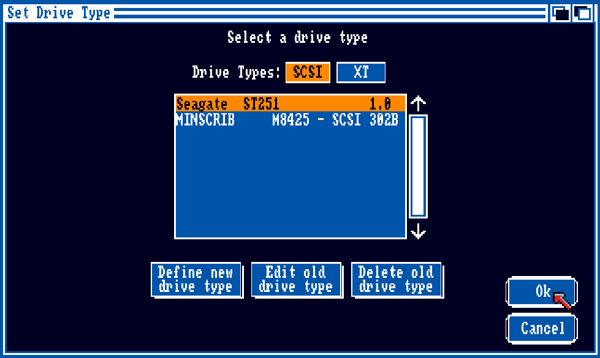

In the `Set Drive Type` dialog, pick the new `Seagate ST251 1.0` type and click `Ok`.

The main screen of *HDToolbox* should now show the new drive type configured for SCSI interface `0`. 

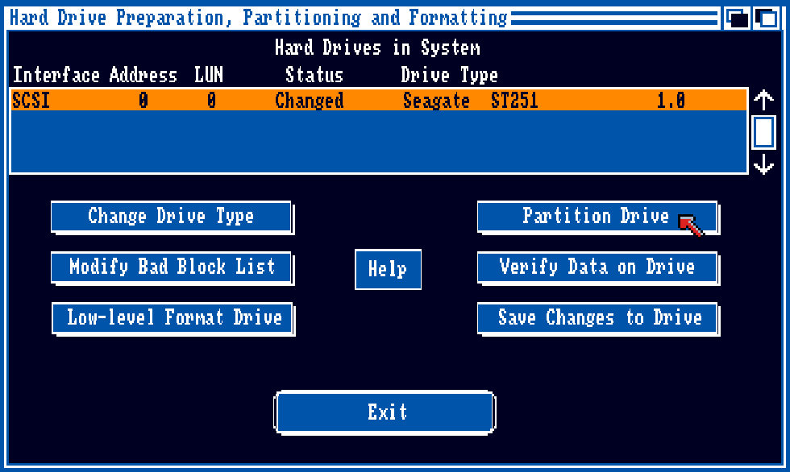

Click on `Save Changes to Drive` to store the changes to the drive type. The status changes to `Unchanged`. 

## Partitioning hard drive

The next steps involve partitioning the drive.

With the SCSI entry for the Seagate ST251 selected click on the `Partition Drive`.

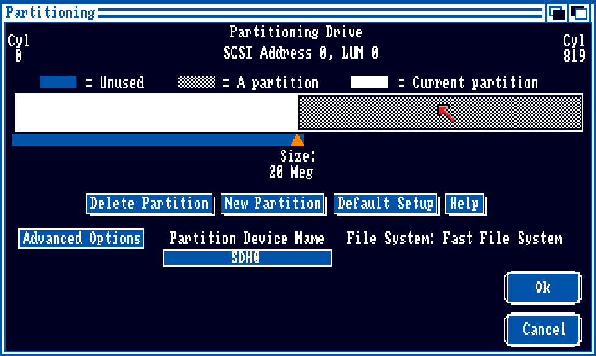

The default setup suggests two equally sized partitions. As long as the first partition is at least 6 MB the Epyx Handy development kit files can be restored. 

A single partition will work, so you can remove the second partition. To do so, select the right side of the partition layout. It becomes the current partition as indicated by the solid white color. Click the `Delete Partition` button to remove it.

Next, with the single partition on the left automatically selected, click on `Advanced Options`.

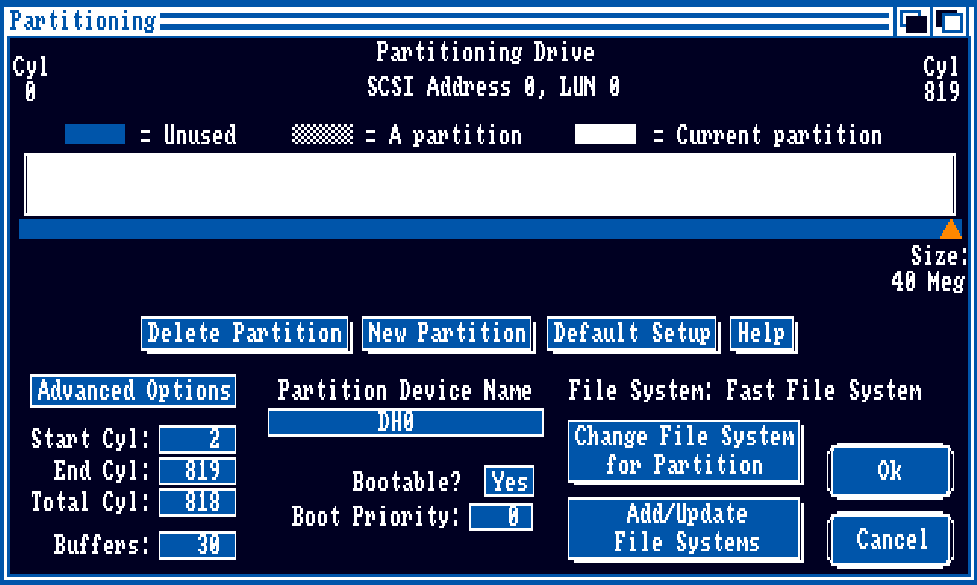

Fill in the details for the drive, in particular the name `DH0` and the `End Cyl` of `819` for the zero-based cylinder count (of the 820 total). You can leave all other values as is, including the Fast File System (12248 bytes) for this partition. Exit the dialog by clicking `Ok`.

At the main screen again, click `Save Changes to Drive` once more. It will prompt that there will be changes to the default setup of `UDH0` and `UDH1`. Click `Continue` to acknowledge the changes.

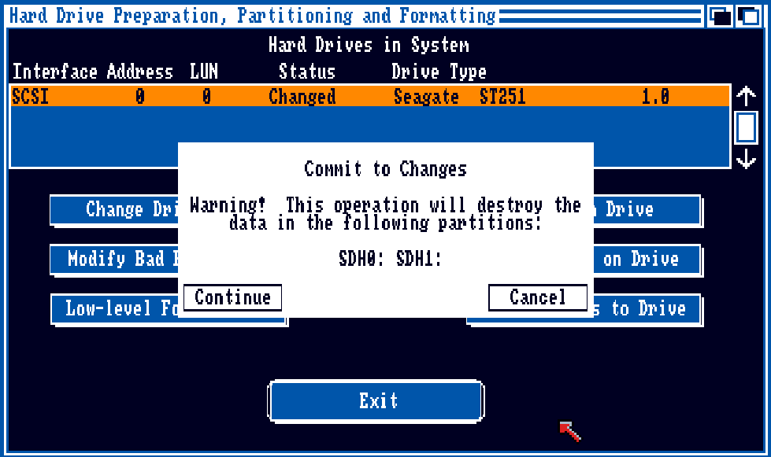

The partitioning is now complete and you can exit *HDToolbox*.

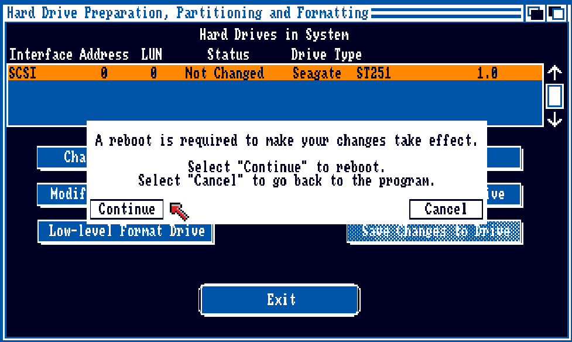

A reboot is now required. Click `Continue` to reboot.

> #### A scriptable (and faster) alternative
>  
> You can also use the `rdbtool` from the [Amitools](https://github.com/cnvogelg/amitools) suite to create the hardfile with the correct file size, partition and file system:

> ```
> rdbtool a590-st251.hdf create size=42835968 chs=820,6,17 
> rdbtool a590-st251.hdf init
> rdbtool a590-st251.hdf add name=DH0 bootable=true pri=0 automount=true start=2 end=819 dostype=DOS1
> rdbtool a590-st251.hdf fsadd FastFileSystem version=36.03
> ```

## Formatting hard drive main partition

After the reboot a new drive should appear on the Workbench main screen.

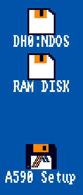

The new drive corresponds to the new `DH0` partition created with *HDToolbox*.

Open the `A590 Setup` drawer and start the *Shell* utility for a command-line interface (CLI).

At the CLI initiate the format operation by issuing the command:

```
format drive DH0: name AmigaHD FFS
```

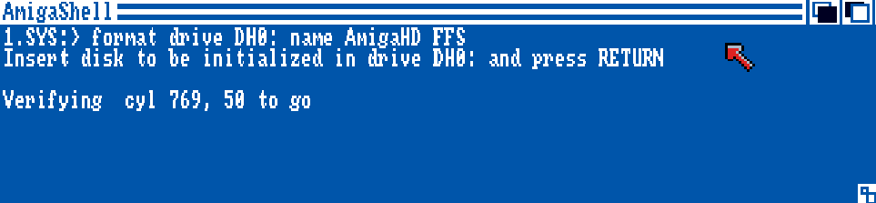

## Restoring
