# Handy development environment installation guide for WinUAE

This guide will help you prepare a virtualized setup of the Handy development environment using the Commodore Amiga emulator WinUAE. The aim is to replicate the environment as closely as possible, using the original setup of a Commodore Amiga 2000 or 500 and a harddisk.

The guide involves several steps and assumes you have some experience in using AmigaOS and Workbench.

The preparation steps are as follows:

1. Prepare a virtual hard disk with required partitions.
2. Create an emulator configuration for the Commodore Amiga 500/2000.
3. Mount, format and restore partitions of the prepared hard disk.
4. Finish setup, including startup sequence and additional preparation.
5. Create final WinUAE configuration

The final Handy development environment requires version 1.3 of both Kickstart and Workbench. If you plan to follow along with step 1 to 4, it will additionally require Kickstart and Workbench version 3.1. However, the resulting hard disk is included in the repository that contains the `adf` and `hdf` files for the Handy development environment. It allows you to skip step 1 to 4 and use the `hdf` file in the final step.
It is recommended to skip to step 5 and setup the WinUAE environment with the resulting hardfile. It saves a substantial amount of time.

> ### Acquiring Kickstart and Workbench versions
> 
> You can acquire the required Kickstart and Workbench files as part of an [Amiga Forever](https://www.amigaforever.com/) package. 
> 
> At the time of writing the Value edition only has support for the Amiga 500 with Kickstart 1.3 and Workbench 1.3. This is sufficient to setup the development environment. 
>
> However, should you want to manually configure the virtual hard disk for the environment, you will need the Amiga Forever Plus package (or Premium) that includes the newer versions (including 3.1).

### Prerequisites:

**Required:**

- WinUAE emulator
- Kickstart 1.3 ROM file (`amiga-os-130.rom`)

**Optional:**

- Workbench 1.3 Boot disk (`amiga-os-134-workbench.adf`)
- Kickstart 3.1 ROM files (`amiga-os-310-a1200.rom`)
- Workbench 3.1 Install disk (`amiga-os-310-install.adf`)
- Quarterback 4.3 or 5.0 disk file (as `adf` files)

The optional files are only needed if you want to create the hardfile in step 1 to 4. 

# Step 1 (optional): Creating a 2 partition disk with FastFileSystem

The original documentation of the Handy development kit describes a Commodore Amiga 2000 or 500 with a 40 MB harddisk that has 2 partitions:

1. A boot partition with the normal Old File System (OFS) named `BootPart`
2. A second with international fast file system named `AmigaHD` to contain the Handy development kit files

Use any Commodore Amiga configuration with Kickstart 3.1. Open the WinUAE properties dialog (by pressing `F12`) and go to `Settings > Hardware > CD & Hard drives` in the left tree structure.

Create a new hardfile at the bottom area of the dialog. Enter 40 MB as the size and click `Create`.
Save the hardfile as `epyx-handy-16.hdf`, to indicate its purpose for Epyx Handy development kit 1.6.

The newly created hardfile will automatically be selected at the top dropdown. Name the drive `DH0`. Make sure that the `Full drive/RDB mode` is not selected. Also, the configuration of this drive should be:

|||
|---|---|
|Surfaces|1|
|Sectors|32|
|Reserved|2|
|Block size|512|

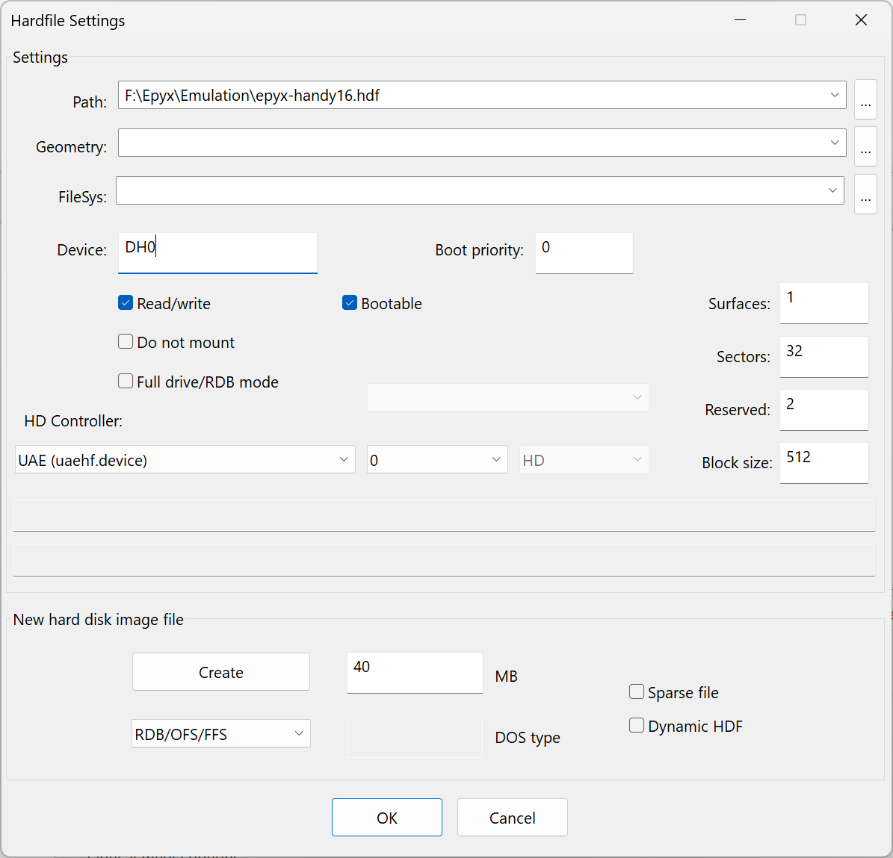

 Insert the "AmigaOS 3.1 Install" floppy diskette into `DF0` (`amiga-os-310-install.adf`) and start the emulator. After the booting has completed, open the drawer `HDTools` and select the `HDToolBox` icon. Do not start it, but instead open the "Information" dialog by keeping the right mouse button pressed and going to the top menu in Workbench.

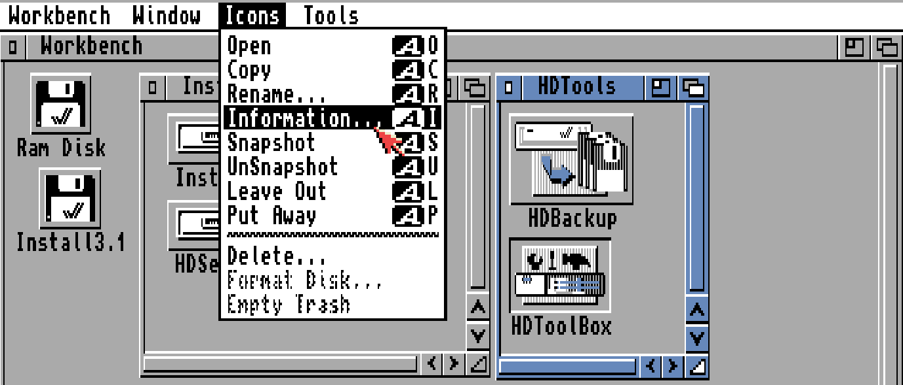

Check the lines of the "Tool types" that read:

```
SCSI_DEVICE_NAME=scsi.device
SCSI_MAX_ADDRESS=6
SCSI_MAX_LUN=7
XT_NAME=  XT
```

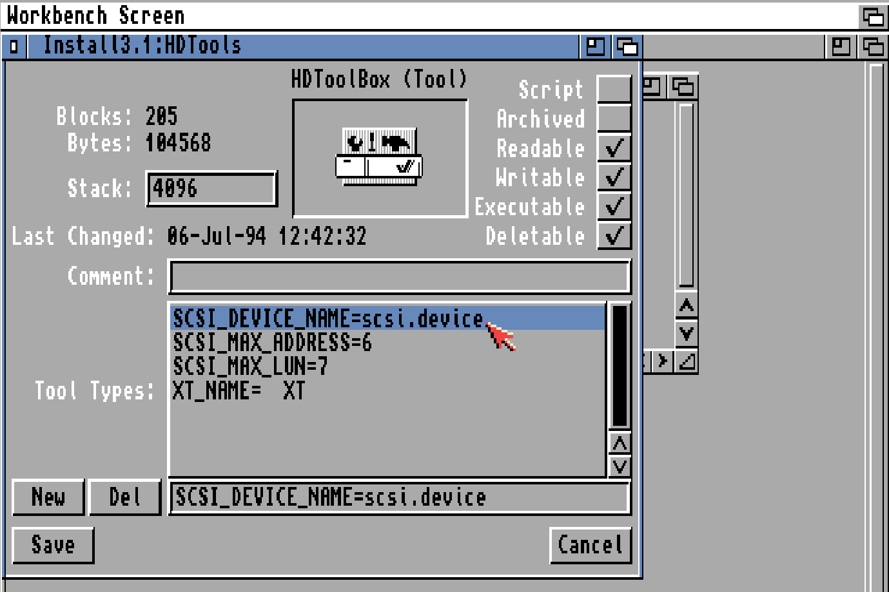

Select the top line so it appears in the textbox next to the `New` and `Del` buttons. Change the line to use `uaehf.device` so the single line textbox becomes:

```
SCSI_DEVICE_NAME=uaehf.device
```

Make sure to press `Enter` before clicking on `Save`.

Start *HDToolBox* and find the new harddisk available as an SCSI interface with `Unknown` status.

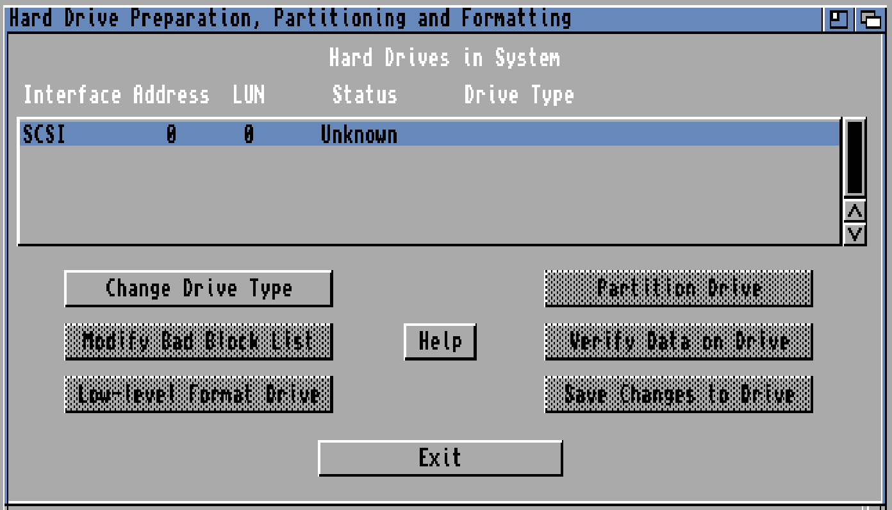

Click on `Change Drive Type` and in the next dialog delete any existing drive types by selecting the drive type in the listbox and clicking on `Delete Old` until all have been deleted and the drive type listbox is empty. 

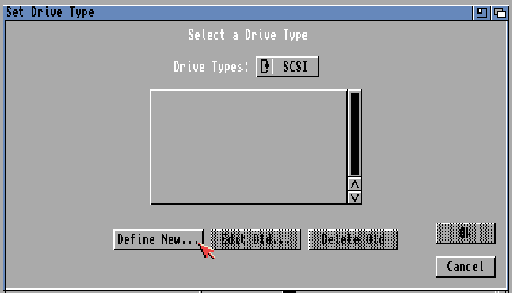

Next, click on `Define New...` to open a new dialog. 

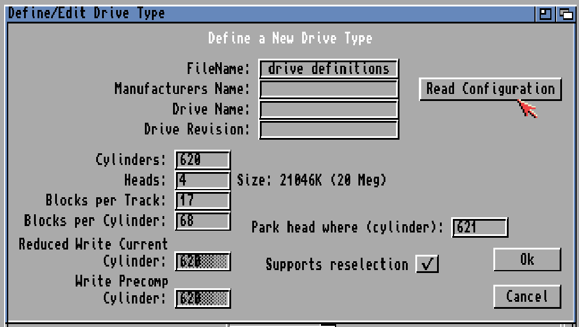

Click the `Read Configuration` button. A message box appears to indicate that most information will be inferred from the drive. 

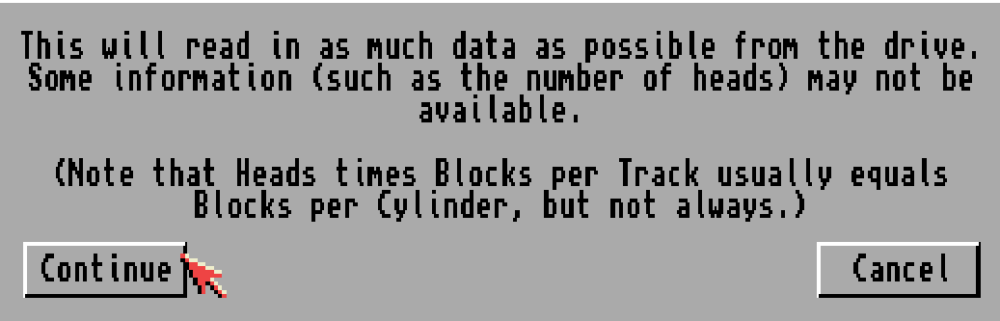

Click `Continue` to read this information.

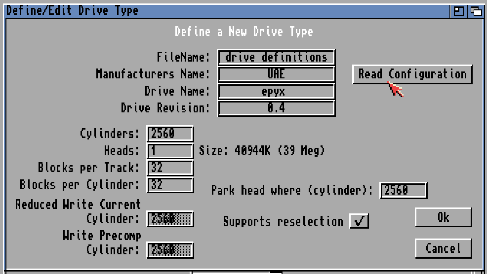

Change the `Drive Name` to be `epyx` for your Epyx specific harddisk. Click the `Ok` button and in the next dialog `Ok` again.

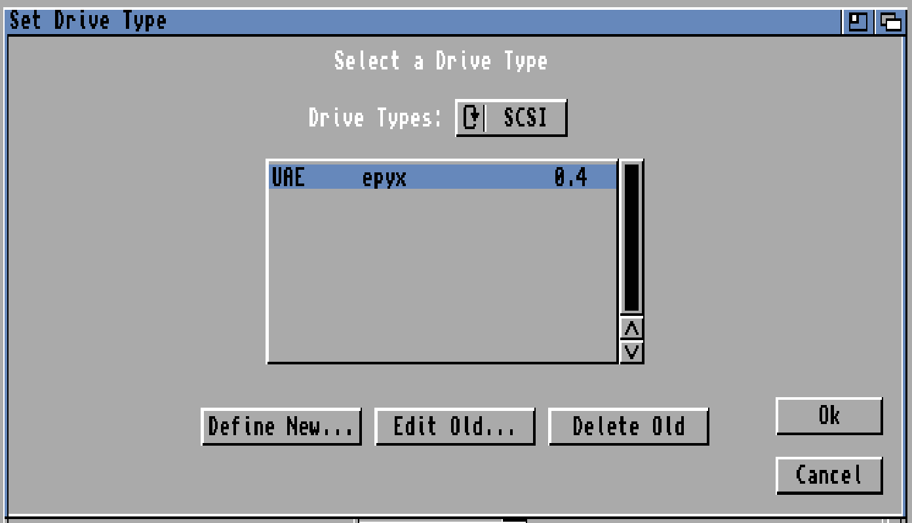

You should now see that the other buttons also became available.

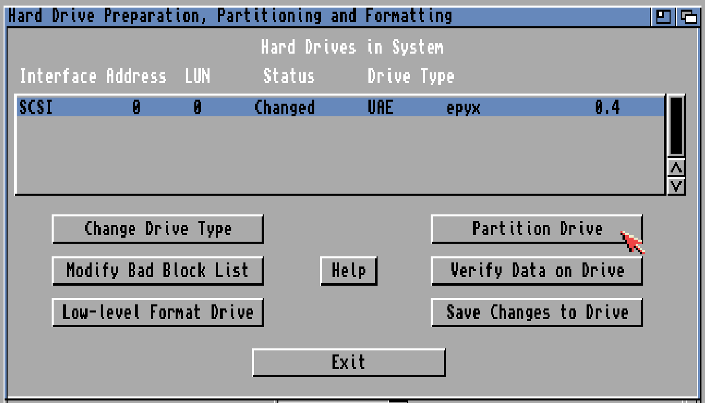

Select the `epyx` drive and click the `Partition Drive` button.

The "Partitioning" dialog opens and shows existing partitions. 

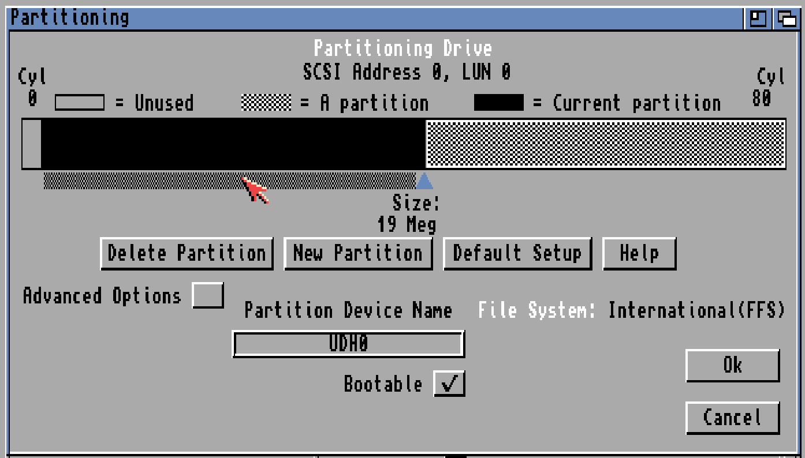

Delete any existing partitions. Click the left side of the disk layout drawing at the top and move the triangle shaped slider at the bottom of it to the left. The size of the first partition should be around 5 MB, sufficient for the few files that will be stored. Enter the `End Cyl` as `330` for the end cylinder.

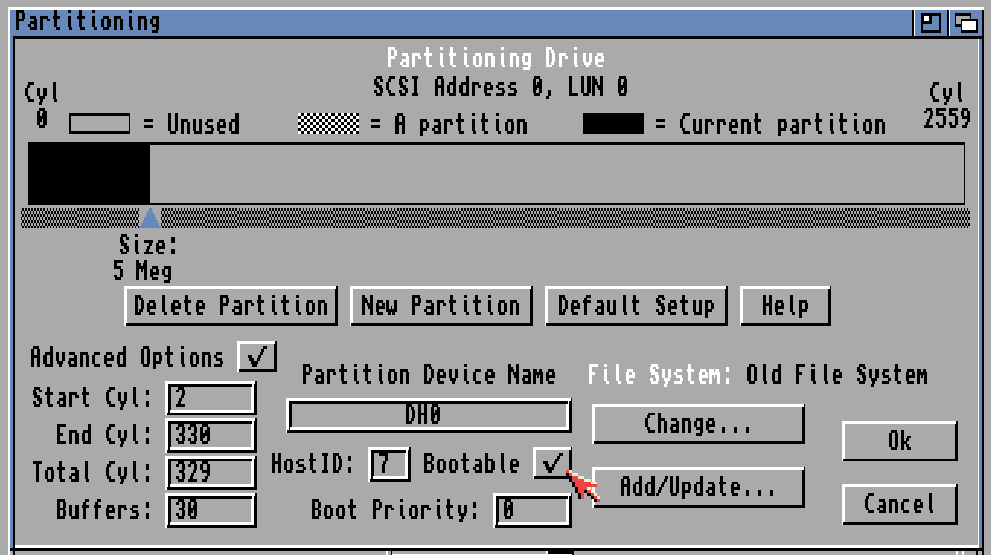

Change the `Partition Device Name` to `DH0`, press `Enter`. Select the `Bootable` and `Advanced Options` checkboxes. The dialog will show additional options including button `Change...` and `Add/Update...` to configure the file system types. Click the `Change...` button.

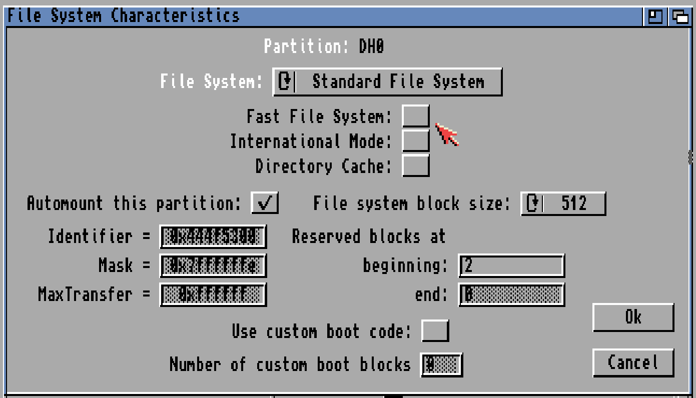

In the "File System Characteristics" dialog edit the `MaxTransfer` value to be `0x0001fe00`. Uncheck the `Fast File System` and `International Mode` checkboxes. Click on `Ok` to return to the "Partitioning" dialog.

Create another partition by clicking the `New Partition` button. Click to the right of the first 5 MB `DH0` partition in the black rectangle indicating the remaining space on the disk.

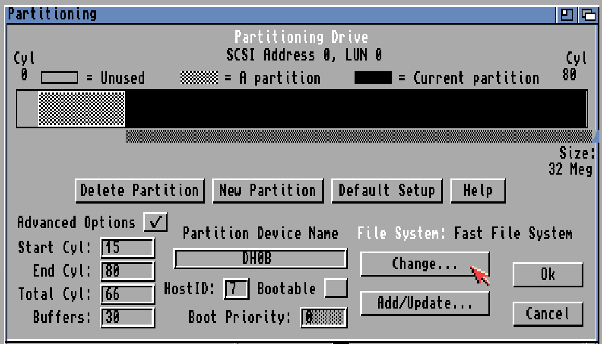

Set the `Partition Device Name` to be `DH0B` and press `Enter` again. Make sure that the drive is not marked as `Bootable`, since it should not be booted from.

Go into "File System Characteristics" dialog by clicking `Change...`. Uncheck the `Auto-mounted this partition` to prevent automatic mounting of this partition as a drive. The startup script will take care of this later. 
Also, change the `MaxTransfer` value to be `0x1fe00` again. Click on `Ok` to save the changes in the current dialog.

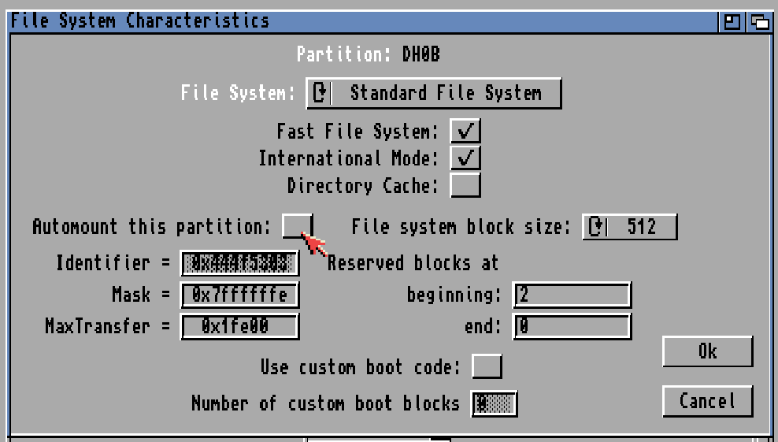

Back in the "Partitioning" dialog, click on the `Add/Update...` button. The "File System Management" dialog opens and it will probably show an existing `FastFileSytem` file system name of version 40.1 and identifier `0x444f5301`. This is not the correct file system, as the one included with the Handy development kit is of a different version.

Insert the "Handy Boot Disk" diskette `handy-16-boot.adf` into floppy drive `DF1`. Next, click on `Add New File System...` to add a different version of FastFileSystem.

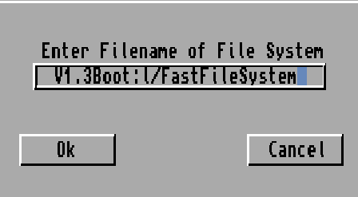

The inserted Handy boot diskette is labeled `V1.3Boot`. You can provide the filename of the correct FastFileSystem as `V1.3Boot:l/FastFileSystem`. Click `Ok` and provide the version details of the FastFileSystem in the dialog that appears. It should be version `34` and revision `85`.

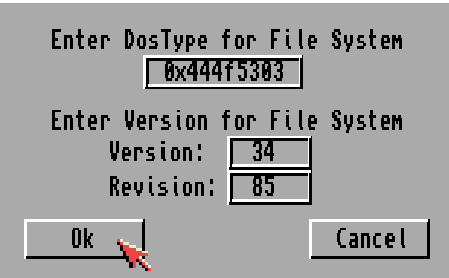

The DosType for the file system should be `0x444f5303`, which corresponds to the hexadecimal values for the characters `DOS3`. Click `Ok` to return to the "File System Maintenance" dialog that now shows an additional file system registered with a size of 12204 bytes. 

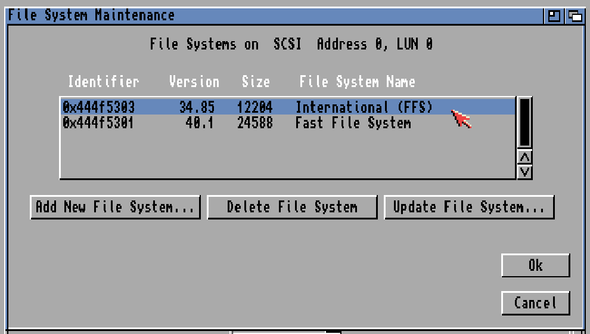

Delete the newer version `40.1` of the file system named `Fast File System`. Click `Ok` to return to the "Partitioning" dialog and close it by clicking `Ok` once more. Back in the "Hard Drive Preparation, Partitioning and Formatting" dialog you should see that the listed `epyx` harddrive now has a status of `Changed`. Commit the changes by clicking on the `Save Changes to Drive` button.

> ### Not enough space
>
> If you accidentally forgot to remove the `40.1` version of the file system, you will get an error indicating there is not enough room on the disk to save the changes.
>
> 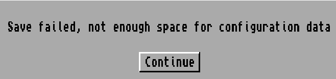
> 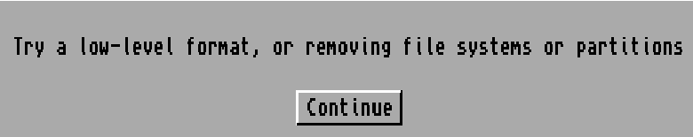
>
> If so, retrace via `Partition Drive` and click `Add/Update...` to return to the "File System Maintenance" dialog and do remove the file system with version `40.1`.

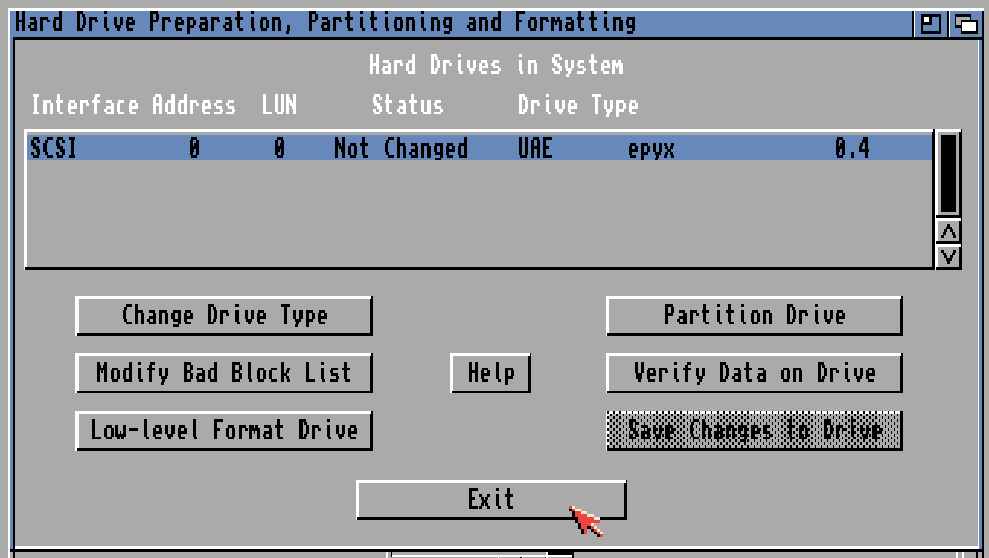

Make sure the hard drive shows a status of `Not Changed`. Finish this part of the drive preparation by clicking the `Exit` button and return to Workbench.

At this point you can exit the emulator. Create a copy of the `epyx-handy-16.hdf` file to have a backup of the newly partitioned system.

## Step 2 (optional): WinUAE configuration for Workbench 1.3

Start WinUAE on your development machine. It should open the dialog for the properties of the emulator. Go to `Configurations` and in the bottom section provide the name `handy-16-workbench-135.uae` and description `Lynx Development Environment 1.6 - Workbench 1.3` for the configuration file. Click on `Save` to store it. 


Next, go through the `Hardware` section and change the following properties per node in the configuration tree:

|Node|Setting|Value|
|---|---|---|
|**CPU and FPU**|CPU Emulation Speed|Fastest possible|
|**ROM**|Main ROM file|Kickstart v1.3 rev 34.5 (or any other modern version of Kickstart S1.3)|
|**RAM**|Chip|2 MB|
||Slow|1 MB|
||Z2 Fast|4 MB|
|**Floppy drives**|Floppy Drive Emulation Speed|Turbo|

Under `Hardware > Floppy Drives` make sure that both `DF0:` and `DF1:` are selected. Eject any loaded `.adf` files by clicking the `Eject` button per floppy drive.

If you prefer, you can change the settings under `Host > Display` to be a fixed size for the emulator window:


Add the `epyx-handy-16.hdf` from step 1 as the sole hardfile.
Enter `DH0` as the `Device` name and select `Manual geometry`. Enter the values from before:

|||
|---|---|
|Surfaces|1|
|Sectors|32|
|Cylinders|2560|
|Block size|512|

Make sure that the `Bootable` checkbox is selected and that the HD Controller is set to unit 0 in the dropdown to the right of `UAE (uaehf.device)`. Your dialog should now resemble this:

 

Finally, save this configuration by going to the `Configurations` node again and clicking `Save` once more.

Insert the Workbench 1.3 diskette in `DF0` and boot the system from the floppy drive for now.

## Step 3: Mount, format and restore partitions

Start the emulator with the current configuration. Workbench 1.3 should open and show three drives on the desktop. 

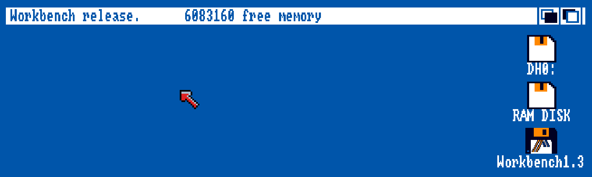

One is called `DH0:` and  represents the first partition created earlier from which the Amiga will boot later on. It needs to be formatted, or "initialized" as it is called under Workbench 1.3.

Select `DH0:` and right-click to select `Initialize` from the `Disk` top menu. There will be a few dialogs, which you should confirm to start the initialization. 

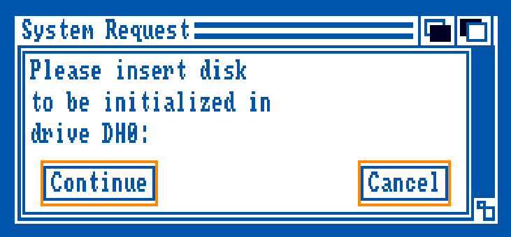
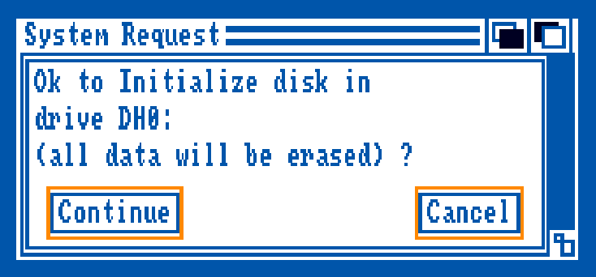

After a few seconds the name of the drive will change to `Empty`.

Assuring the drive is still selected, right-click to select `Rename` from the `Workbench` menu. Change the name to be `BootPart`.

Now that the boot partition is formatted, the Handy backup for `DH0` (or `BootPart`) can be restored.

Insert the `quarterback-50.adf` diskette into `DF1` and open the drawer.

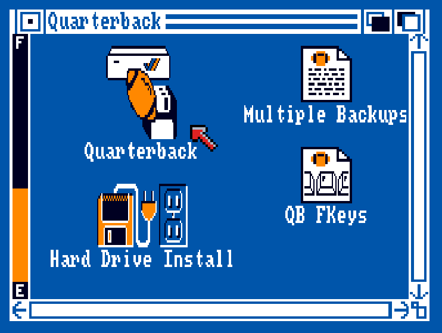

Start the *Quarterback* program. First, select the `BootPart` drive to restore to. After selecting that drive, click on `Restore`.

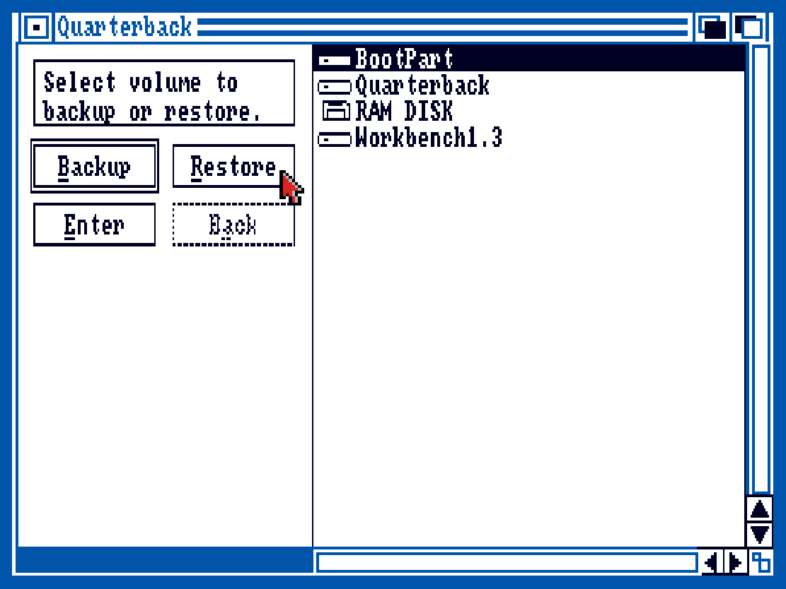

On the next dialog with "Restore options" deselect drive `DF0` and select the option to `Restore empty drawers` and click `OK` to continue to the next dialog. 

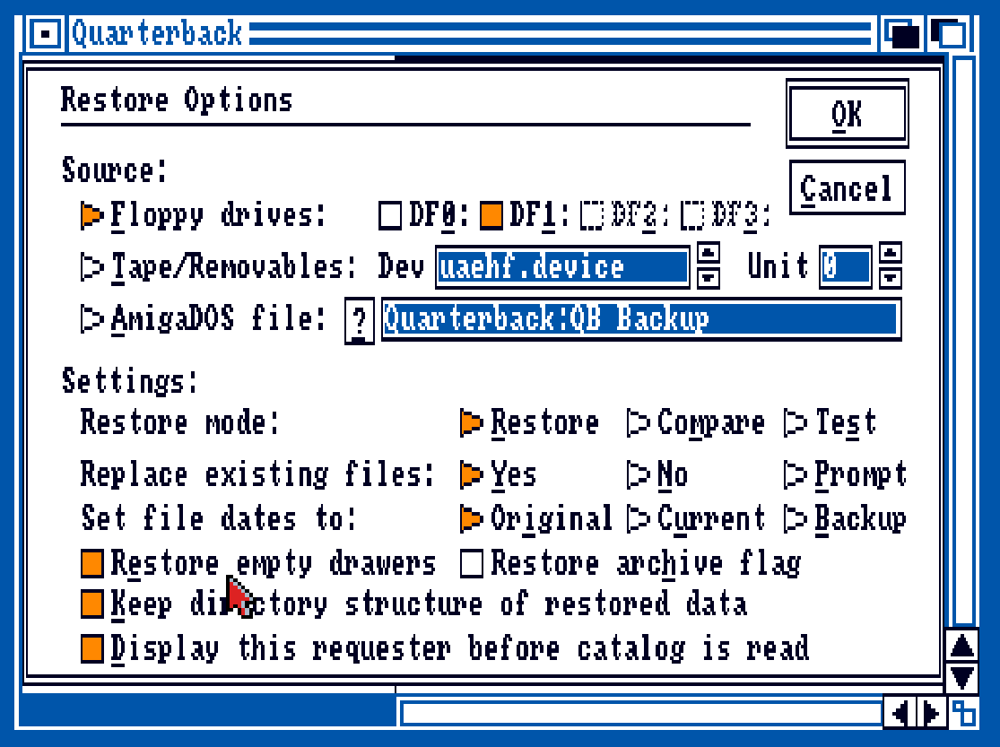

You will get a prompt that the inserted diskette is not a backup set. 


Insert `handy-16-dh0.adf` containing the backup set for the boot partition. It has just enough files to defer booting to the other partition `AmigaHD` which will be created later. Next, *Quarterback* will show all files in the backup set. 

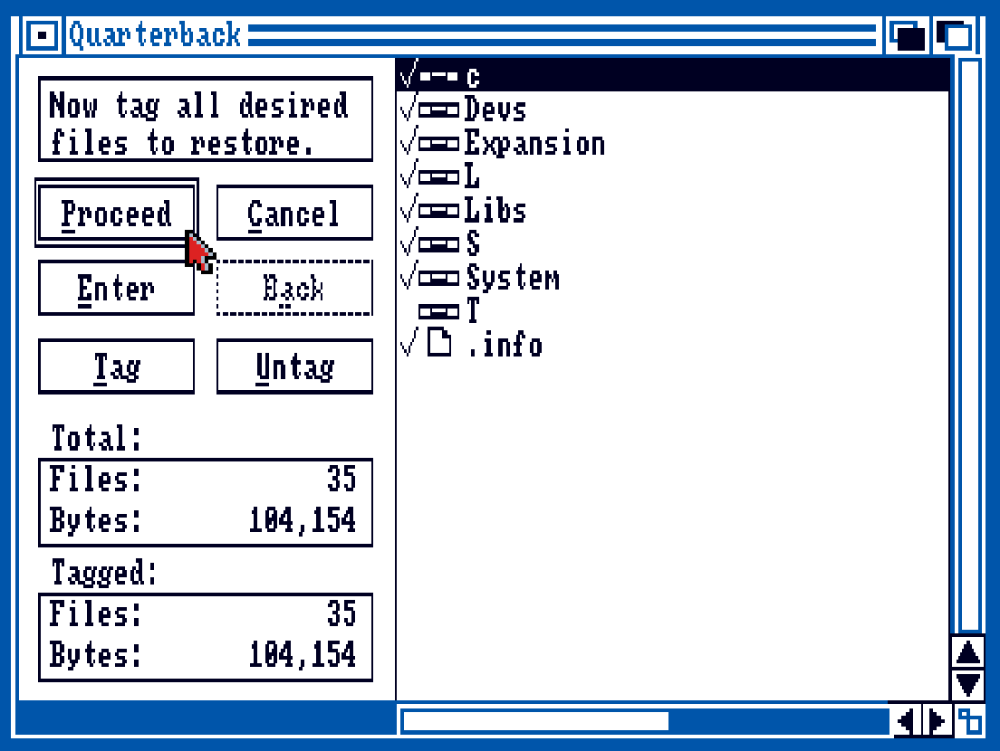

Leave all files and folders checked, but do click on `T` and the `Tag` button to restore the empty `T` folder as well. Click on `Start` to restore the backup.

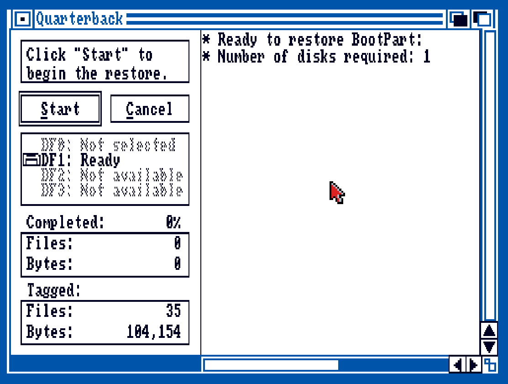

The restore progress will be reported and should complete quickly.

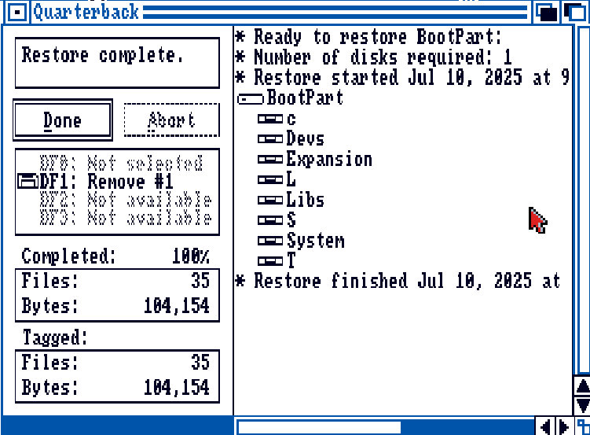

Quit Quarterdeck and close the drawer as well. Eject the Quarterback backup disk `handy-hd0.adf` floppy from `DF1` as well. You can restart the emulator now if you want.

Open a new shell window by double clicking the Shell icon found in the `Workbench1.3` drive. Change the current folder to `BootPart:` using the CLI. Check the contents of the `l` folder.

``` 
cd BootPart:
dir l
```

You should see that the folder contains the following files:

```
Disk-Validator
FastFileSystem
Ram-Handler
vdk-handler
```

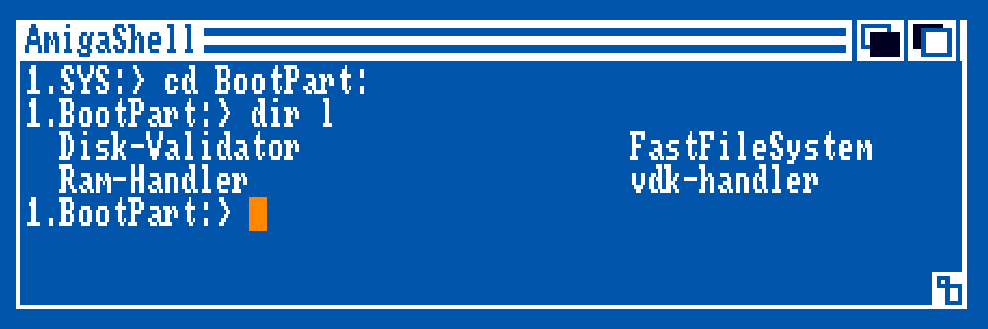

Similarly, ask for the directory contents of `devs`. Notice that there are two example `MountList` files available for the ST225 and ST251 Seagate drives originally used in the Amiga 2000 setup. 

```
cd devs
dir
```

Copy one of these files to a new file called `MountList`. This mount list file which will be used during mounting of devices. Start editing the file with the *Ed* editor found as `ed` under the `SYS:` assignment in the `c` folder.

```
copy MountList.ST225 MountList
SYS:c/ed MountList
```

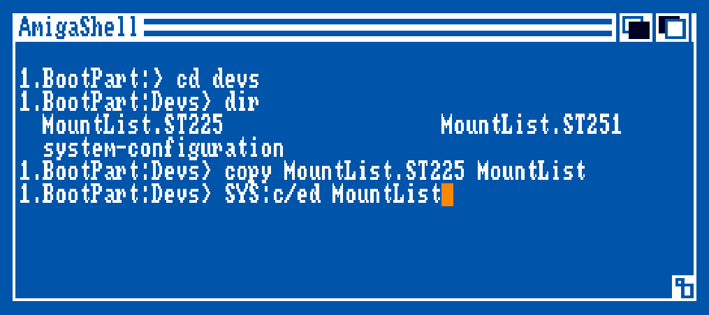

The *Ed* editor will open and show the contents of the `MountList` file. Scroll down to find an entry for the `VDK:` device using the `vdk-handler` from the `DH0:devs` folder.

```
VDK:	Handler = L:vdk-handler
		StackSize = 2000
		GlobVec = -1
		Priority = 5
#
```

Just above the `VDK:` entry you should also find the `DH0B:` entry. This is the device corresponding to the second partition of the hardfile, which has a partition with the same name `DH0B`. The entry needs to be changed based on the values of the second partition of the actual virtual drive created in step 1.

```
DH0B:
    Device = uaehf.device
    FileSystem = l:FastFileSystem
    Unit   = 0
    Flags  = 0
    Surfaces  = 1
    BlocksPerTrack = 32
    Reserved = 2
    Interleave = 0
    LowCyl = 331  ;  HighCyl = 2559
    Buffers = 30
    GlobVec = -1
    BufMemType = 1
    Mount = 1
    DosType = 0x444F5303
    StackSize = 2048
	MaxTransfer = 0x0001FE00
#
```

Save the modified contents of the `MountList` file by pressing the escape key `Esc` on your keyboard. An asterisk will appear at the bottom of the *Ed* program. type `x` and press `Enter` to save the file. You can use `q` and `Enter` to quit without saving after confirming with `Y`.

Now that the mount list correctly defines the second partition `DH0B` it can be mounted and formatted.

```
assign Devs: BootPart:Devs
assign L: BootPart:L
mount DH0B:
format drive DH0B name AmigaHD FFS
```

After the formatting has completed, you should see a new drive called `AmigaHD` appear in Workbench.

## Step 3: Restore AmigaHD partition

Refer to the guide [Restoring Epyx Handy development kit](restoring-handy-amigahd.md) to restore the main files of the Epyx backup set.

## Step 4: Finalizing setup

There are a couple of steps remaining to finish the setup of the Handy development kit. 

The startup script `S/Startup-Sequence` in the boot partition `BootPart` will mount the second partition `DH0B` (with logical name `AmigaHD`). 

```
c:cd c:
SetPatch >NIL: ;patch system functions
Sys:System/FastMemFirst ; move C00000 memory to last in list
Mount vdk:
BindDrivers

IF EXISTS DH0:c 
 ; hard disk is present
 dh0:c/cd     dh0:c             ; look for remaining commands on hard disk
 assign devs: dh0:devs          ; get remaining drivers, etc. from hd
 Mount  DH0B:                   ; mount FFS partition
 assign SYS:   DH0B:             ; switch everything over to it.
 assign c:     SYS:C
 assign L:     SYS:L
 assign S:     SYS:S
 assign DEVS:  SYS:Devs
 assign LIBS:  SYS:libs
 assign FONTS: SYS:Fonts
```

After mounting, it switches over all assignments of logical names to the newly mounted partition, as it contains the full Workbench installation.

The second partition `AmigaHD` also needs a `MountList` file, just like the first partition `BootPart`. Start a new Shell window and copy the `MountList` file to the new partition `AmigaHD`.

```
copy BootPart:devs/MountList AmigaHD:devs
```

In addition, the startup script needs some AmigOS commands like `if`, `else`, `endif` and for simple editing `ed`.

```
copy sys:system/format#? BootPart:system
copy c/ed BootPart:c
copy c/if BootPart:c
copy c/endif BootPart:c
copy c/else BootPart:c
```

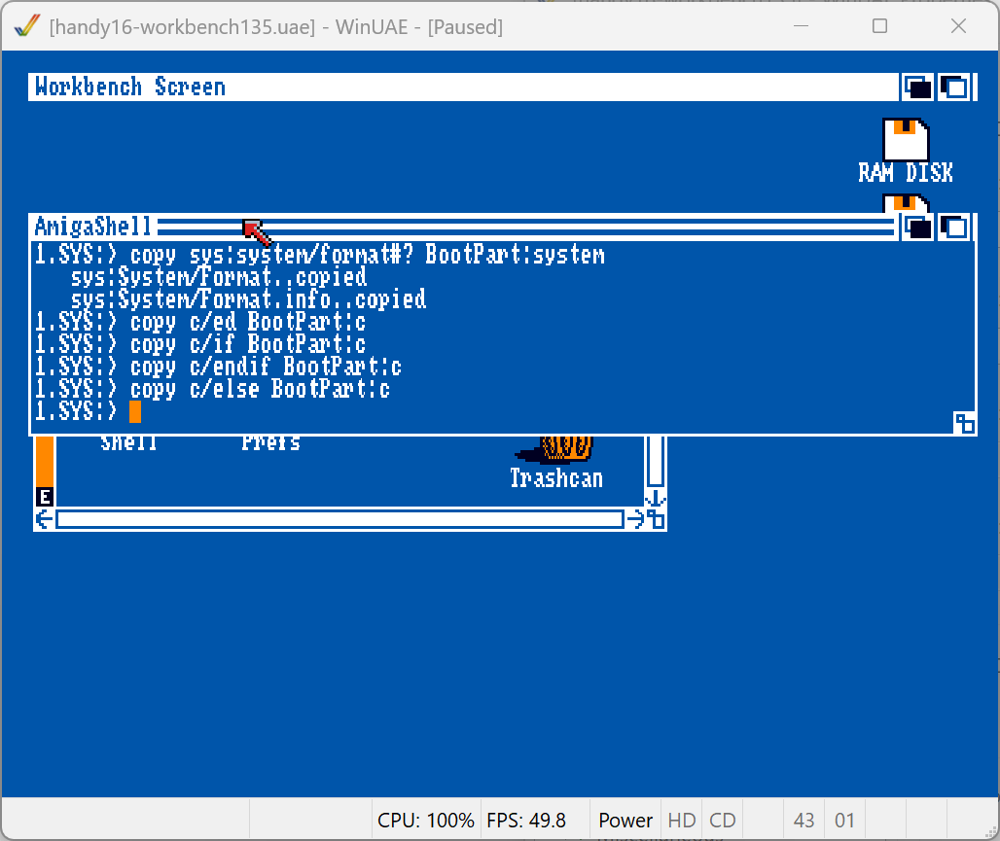

After you have copied over these files the setup is complete and you can boot into the new hardfile only configuration. Eject any `adf` files from the drive and restart the virtualized Amiga with `Ctrl+LeftAmiga+RightAmiga`. 

The first time the new setup boots it encounters an error in the script file `s/startup-sequence.epyx` for the Epyx startup sequence. 

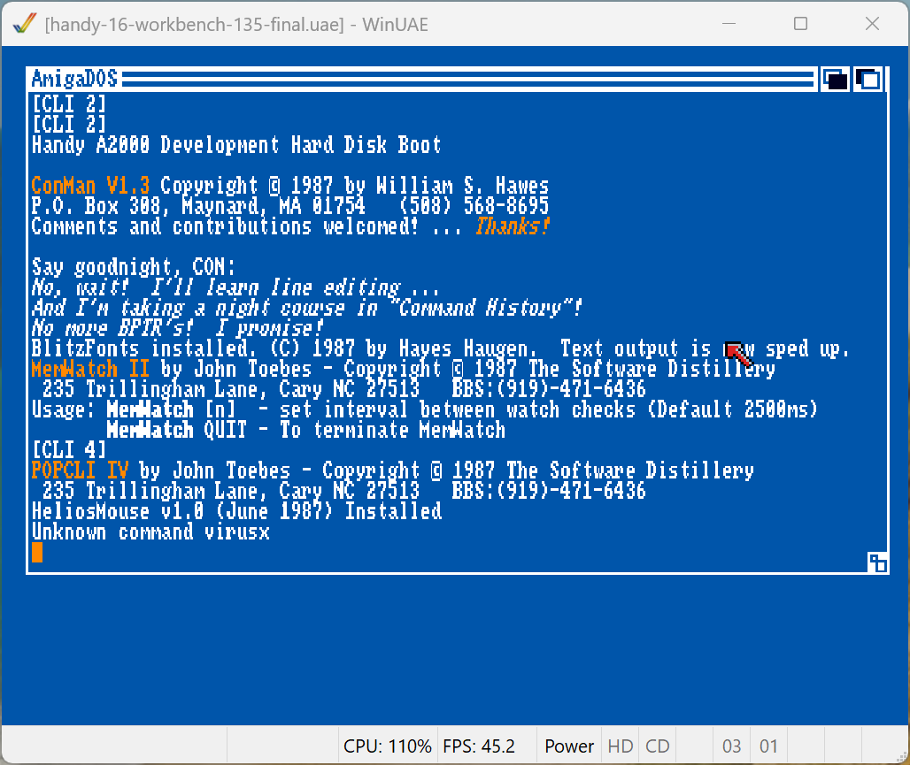

The command to run `virusx` is not succeeding as this software is not present on the partition. It wasn't included in the backup set. The quickest remedy is to remove the call.

Use *Ed* to edit the file `startup-sequence.epyx` on the `AmigaHD` partition.

```
BootPart:c/ed AmigaHD:S/startup-sequence.epyx
```

Comment out the line that reads `virusx`

```
;virusx
```

Save the file by pressing `Esc`, then `x` and `Enter`.
Reboot the emulator again and the Workbench screen should resemble this final result:

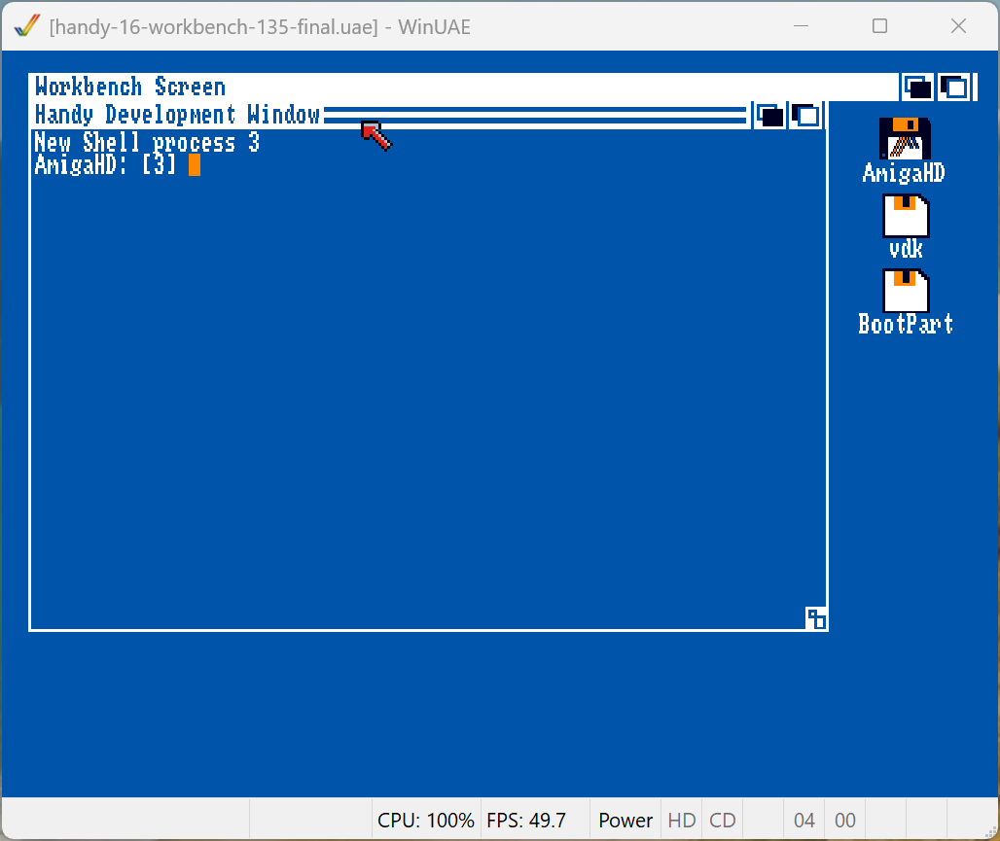

In the `Handy Development Window` you can use the Handy tooling to build Atari Lynx software. Have fun.

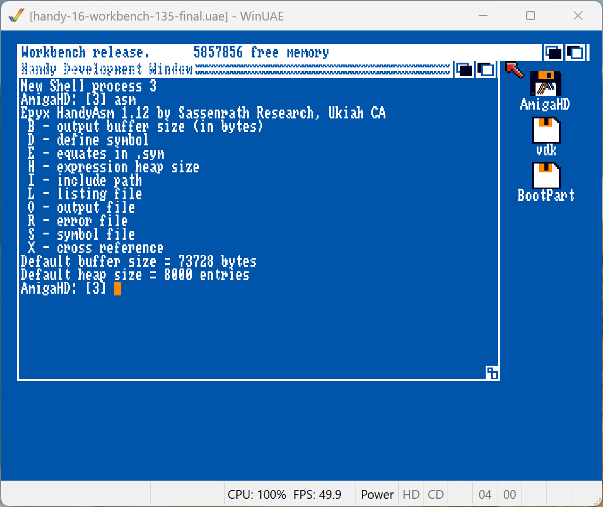