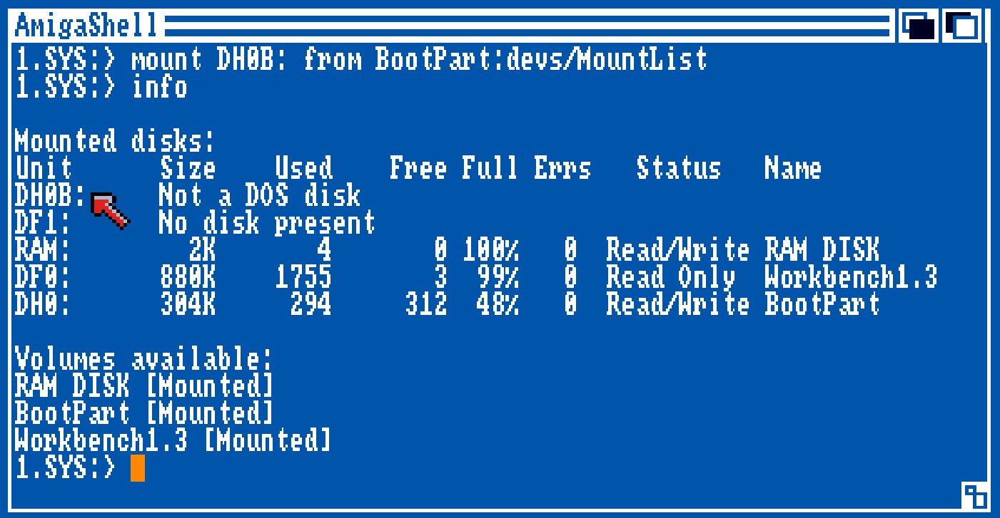

# Creating hardfiles 

## Manual creation of hardfiles

## Using RDBtool

The tool `rdbtool` from the Amitools suite allows the creation of Rigid Disk Block (RDB) hardfiles from the command-line. It uses Python to run scripts that can create, initialize and manipulate hardfiles for the Commodore Amiga and its emulators.

## Creating a dual partition hardfile

The Handy development in its original setup requires two partitions `DH0` and `DH0B` with the OFS and FFS file systems respectively. 

The `rdbtool` commands required to create a hardfile with the same layout as the Seagate ST-251 are as follows:

```
rdbtool handy-16-st251.hdf create size=42835968 chs=820,6,17
rdbtool handy-16-st251.hdf init
rdbtool handy-16-st251.hdf add name=DH0 bootable=true pri=0 automount=true start=2 end=20 dostype=DOS0
rdbtool handy-16-st251.hdf add name=DH0B bootable=false pri=-128 automount=false start=21 end=819 dostype=ffs
```

Notice how the `automount` property of the second partition is set to `false`. This implies that the `S/startup-sequence` script should mount the partition `DH0B` by using an entry from a mount list file, such as `devs/MountList`.

After creation of the hardfile, you can format it using WinUAE. Add the hardfile to your configuration and start the emulator booting with a boot disk Workbench 1.3. After the booting you can first format the boot partition.

```
format drive DH0 name BootPart
```

Next, make sure there is a `MountList` file in the `BootPart:devs` folder with this entry in it:

```
DH0B:
    Device = uaehf.device
    FileSystem = l:FastFileSystem
    Unit   = 0
    Flags  = 0
    Surfaces  = 4
    BlocksPerTrack = 17
    Reserved = 2
    Interleave = 0
    LowCyl = 21  ;  HighCyl = 819
    Buffers = 30
    GlobVec = -1
    BufMemType = 1
    Mount = 1
    DosType = 0x444F5301
    StackSize = 4000
#
```

The process to create the `MountList` file is described in [Restoring Handy boot partition](restoring-handy-amigahd.md).

You can validate the second partition being mounted correctly by running:

```
mount DH0B: from BootPart:devs/MountList
info
```



This should list the `DH0B` mounted disk as `Not a DOS disk`.

assign L: BootPart:L  
format drive DH0B: name AmigaHD FFS

copy if/endif/else

restore backup

copy BootPart:devs/MountList to AmigaHD:devs


rdbtool st506-st251.hdf create size=42835968 chs=820,6,17
rdbtool st506-st251.hdf init
rdbtool st506-st251.hdf add name=DH0 bootable=true pri=0 automount=true start=2 end=20 dostype=DOS0
rdbtool st506-st251.hdf add name=DH0B bootable=false pri=-128 automount=true start=21 end=819 dostype=ffs
rdbtool st506-st251.hdf fsadd FastFileSystem-12248 version=36.03
