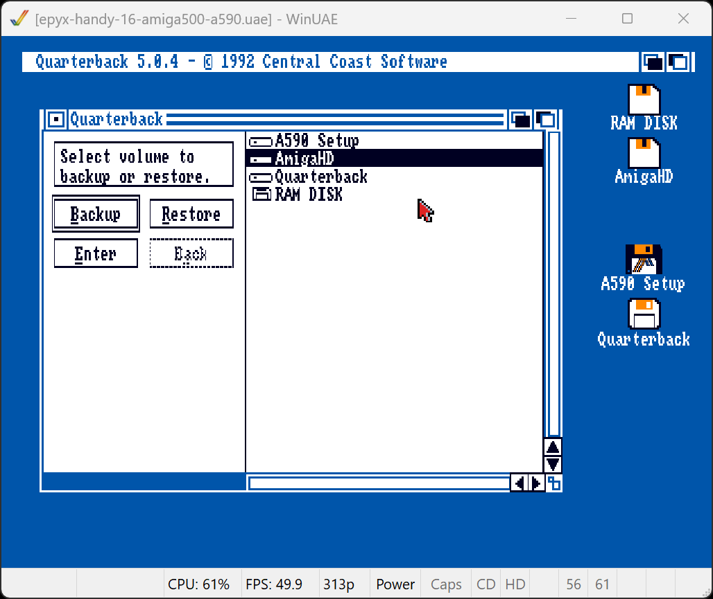
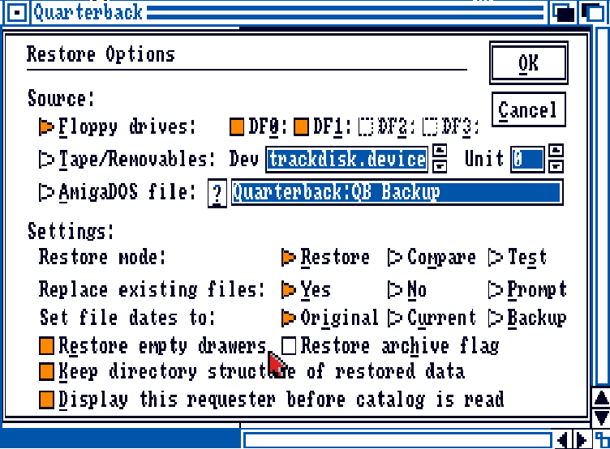
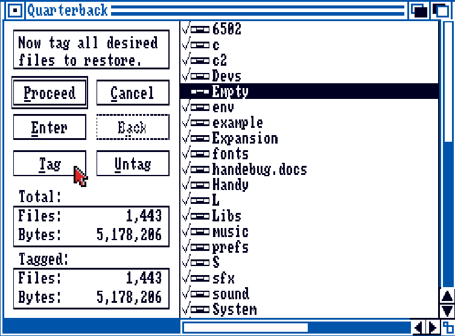
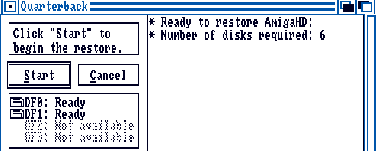

# Preparing Handy development kit main partition

This guide describes how to prepare the main partition for the Epyx development kit for Handy. This included mounting the partition if necessary, restore the *Quarterback* backup set with the Handy development kit (the 6 disk set available in this repository) and changing the startup sequence.

Requirements to perform these steps:

- WinUAE emulator
- Kickstart 1.3 ROM file (`amiga-os-130.rom`)
- Quarterback 4.3 or 5.0 disk file (as `adf` files)
- Workbench 1.3 bootable disk (`amiga-os-134-workbench.adf` or `a590-setup.adf`)

## Preparing `AmigaHD` partition
Load the Amiga Kickstart 1.3 configuration you created earlier for your chosen setup. Make sure a Workbench 1.3 bootable floppy disk in inserted into drive `DF0`. You can use either the Workbench 1.3 Boot disk (or any of the controllers install disks if you have those).

Start the emulator and verify that the AmigaHD drive is present. If it is not, and you have a two partition setup with the `BootPart` partition, mount the `DH0B` partition:

```
mount DH0B: from BootPart:devs/MountList
```

Check again if it has mounted correctly. It should have been formatted in previous steps.

## Restore using Quarterback

Insert the *Quarterback* floppy disk into drive `DF1`, open the `Quarterback` drawer. 


Start the *Quarterback* program. Depending on your setup the listed drives may differ. 



Select the main partition `AmigaHD` where the Epyx Handy files should be restored. Click on the `Restore` button for the next dialog.

In the next dialog keep `DF0` and `DF1` checked so two disk drives can be used to provide the backup set diskettes. Also, check `Restore empty drawers` to make sure empty folders are restored.



Click `OK` and insert disk `handy-16-disk1.adf` with the backup catalog in drive `DF0` when prompted.


After the list of files has loaded, click and tag the drawer `Empty` so it gets restored as well.



> #### Need for an empty drawer
>  
> The `Empty` folder is needed to create new folders in Workbench 1.3. The older versions of Workbench did not have a way to directly create a new folder from a menu option. Instead, one would `Duplicate` the `Empty` drawer and `Rename` it afterwards. 

Click the `Proceed` button to go to the final dialog. Insert `handy-16-disk2.adf` into `DF1` and click on `Start` next.



During the restoring of the files you will be prompted to insert disks 3 to 6 at the appropriate time in the respective drives `DF0` and `DF1`.

The process should be finish almost as fast as you can swap disks. When it is done, close *Quarterback* return to Workbench.

## Startup sequence

During startup the `AmigaHD` partition needs a `MountList` file, regardless of any boot partition that might have prepared mounting it in the two partition setup. The mount list will be used to mount various devices, such as `vdk` and `newcon`. 

Start a new Shell window and copy the `MountList` file to the new partition `AmigaHD`.

```
copy AmigaHD:devs/MountList.ST251 AmigaHD:devs/MountList
```

The next step is changing the `AmigaHD:S/startup-sequence` to make it work if the Amiga boots from the `AmigaHD` partition. The single partition scenario will always automount the `DH0B` partition from the available disk drive. A lot of the startup script is written for the two partition startup, so includes several constructs (such as checking if the harddisk `DH0` is present at all, and redefining system assignments to `DH0B`). Only during a boot directly from `DH0B` will the `AmigaHD:S/startup-sequence` be used. It can be safely changed to optimize this scenario.

Start editing the startup file with the `Ed` editor on the boot disk:

```
SYS:c/ed AmigaHD:S/startup-sequence 
```

A lot of the lines in the script can be removed. The end result should be:

```
SetPatch >NIL: ;patch system functions
Sys:System/FastMemFirst ; move C00000 memory to last in list
Mount vdk:
if not exists vdk:t
 makedir vdk:t
 assign T: vdk:
endif

sys:c/SetClock load
;sys:c/FF >NIL: -0             ;speed up Text - Use BlitzFonts instead
sys:c/resident CLI L:Shell-Seg SYSTEM pure add; activate Shell
sys:c/resident sys:c/Execute pure
sys:c/mount newcon:

failat 11
run execute  s:StartupII ;This lets resident be used for rest of script
wait >NIL: 5 mins ;wait to complete (will signal when done)

run execute  s:Startup-Sequence.Epyx
wait >NIL: 5 mins ;wait to complete (will signal when done)

SYS:System/SetMap usa1 ;Activate the ()/* on keypad

endcli >NIL:
```

These `ed` commands may come in useful when making the edits and saving the file:

|Command|Description|
|---|---|
|`Ctrl+B`|Delete a line|
|`Esc,Q + Enter`|Quit without saving|
|`Esc,X + Enter`|Save file and quit|
|`Esc,SA + Enter`|Save file without quiting|
|`Esc,SA newfile.txt + Enter`|Save as file `newfile.txt`|

Restart the emulator at this point and validate that the startup works correctly

The first time the new setup boots it encounters an error in the script file `AmigaHD:S/startup-sequence.epyx` for the Epyx startup sequence. 


The command to run `virusx` is not succeeding as this software is not present on the partition. It wasn't included in the backup set. The quickest remedy is to remove the call.

Use *Ed* to edit the file `startup-sequence.epyx` on the `AmigaHD` partition.

```
SYS:c/ed AmigaHD:S/startup-sequence.epyx
```

Comment out the line that reads `virusx`

```
;virusx
```

Save the file by pressing `Esc`, then `x` and `Enter`.

Restart the emulator again to validate a proper startup. Note that the `BootPart` drive is only appearing in the two partition scenario.


