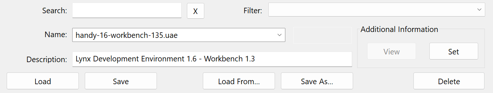
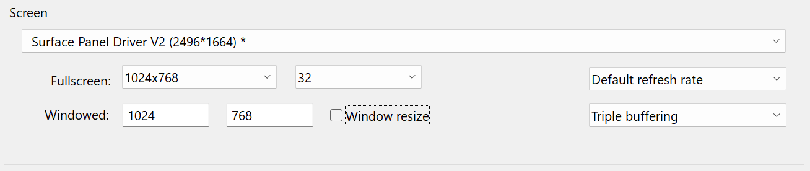
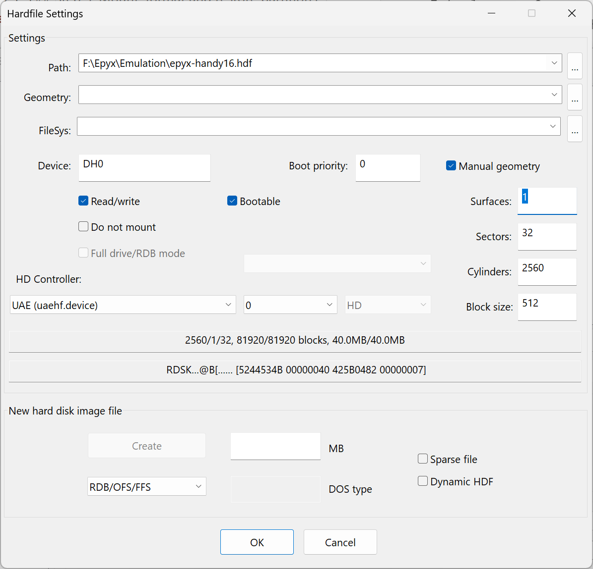

# WinUAE configuration for Workbench 1.3

It is easy to get started with the Handy development environment in WinUAE.
 
Start WinUAE on your development machine. It should open the dialog for the properties of the emulator. Go to `Configurations` and in the bottom section provide the name `handy-16-workbench-135.uae` and description `Lynx Development Environment 1.6 - Workbench 1.3` for the configuration file. Click on `Save` to store it. 

Next, go through the `Hardware` section and change the following properties per node in the configuration tree:

|Node|Setting|Value|
|---|---|---|
|**CPU and FPU**|CPU Emulation Speed|Fastest possible|
|**ROM**|Main ROM file|Kickstart v1.3 rev 34.5 (or any other modern version of Kickstart v1.3)|
|**RAM**|Chip|2 MB|
||Slow|1 MB|
||Z2 Fast|4 MB|
|**Floppy drives**|Floppy Drive Emulation Speed|Turbo|

Under `Hardware > Floppy Drives` make sure that both `DF0:` and `DF1:` are selected. Eject any loaded `.adf` files by clicking the `Eject` button per floppy drive.

If you prefer, you can change the settings under `Host > Display` to be a fixed size for the emulator window:

Add the `epyx-handy-16.hdf` from step 1 as the sole hardfile.
Enter `DH0` as the `Device` name and select `Manual geometry`. Enter the values from before:

|||
|---|---|
|Surfaces|1|
|Sectors|32|
|Cylinders|2560|
|Block size|512|

Make sure that the `Bootable` checkbox is selected and that the HD Controller is set to unit 0 in the dropdown to the right of `UAE (uaehf.device)`. Your dialog should now resemble this:

 

Finally, save this configuration by going to the `Configurations` node again and clicking `Save` once more.

Insert the Workbench 1.3 diskette in `DF0` and boot the system from the floppy drive for now.