Requirements:

- WinUAE emulator
- Workbench 3.1 Install disk 


# Creating a 2 partition disk with FastFileSystem

Use any Commodore Amiga configuration with Kickstart 3.1. Open the WinUAE properties dialog (by pressing `F12`) and go to `Settings > Hardware > CD & Hard drives` in the left tree structure.

Create a new hardfile at the bottom area of the dialog. Enter 40 MB as the size and click `Create`.
Save the hardfile as `epyx-handy16.hdf`.

The newly created file will automatically be selected at the top dropdown. The `FileSys` property should refer to the `FastFileSystem` file that you copied to your local file system. Also, make sure to check the `Full drive/RDB mode` option to enable Rigid Disk Block mode. Name the disk `DH0`.

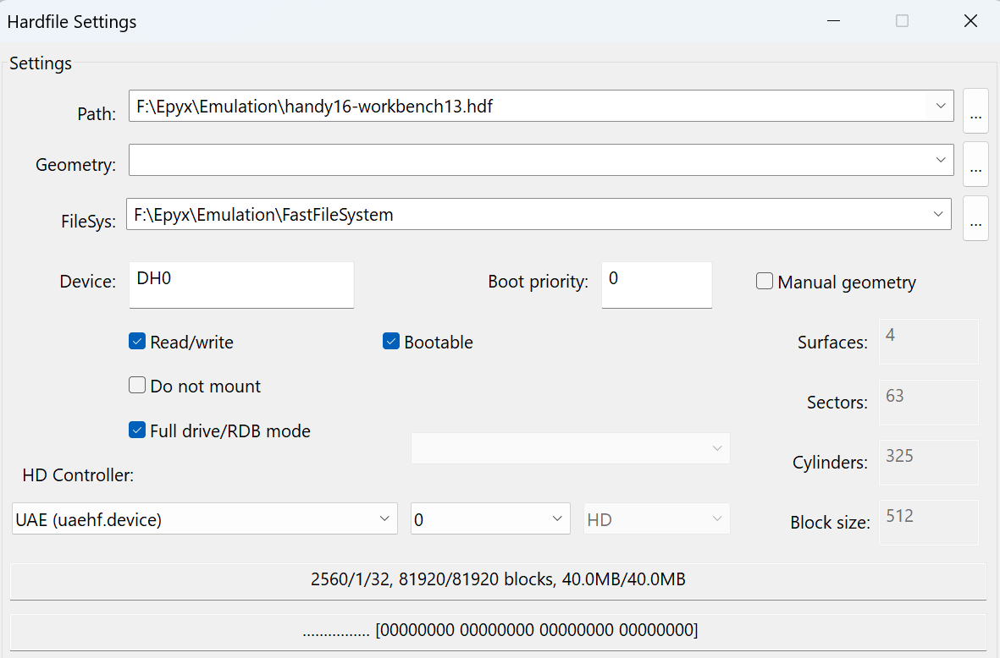

 Insert the "AmigaOS 3.1 Install" floppy diskette into `DF0`. Start the emulator. After the booting has completed, open the drawer `HDTools` and select the `HDToolBox` icon. Do not start it, but instead open the "Information" dialog by keeping the right mouse button pressed and going to the top menu in Workbench.


Check the top line of the "Tool types" that reads:

```
SCSI_DEVICE_NAME=scsi.device
SCSI_MAX_ADDRESS=6
SCSI_MAX_LUN=7
XT_NAME=  XT
```


Select the top line so it appears in the textbox next to the `New` and `Del` buttons. Change the line to use `uaehf.device` so the single line textbox becomes:

```
SCSI_DEVICE_NAME=uaehf.device
```

Make sure to press `Enter` before clicking on `Save`.

Start *HDToolBox* and find the new harddisk available as an SCSI interface with `Unknown` status.


Click on `Change Drive Type` and in the next dialog delete any existing drive types by selecting the drive type in the listbox and clicking on `Delete Old` until all have been deleted and the drive type listbox is empty. 


Next, click on `Define New...` to open a new dialog.

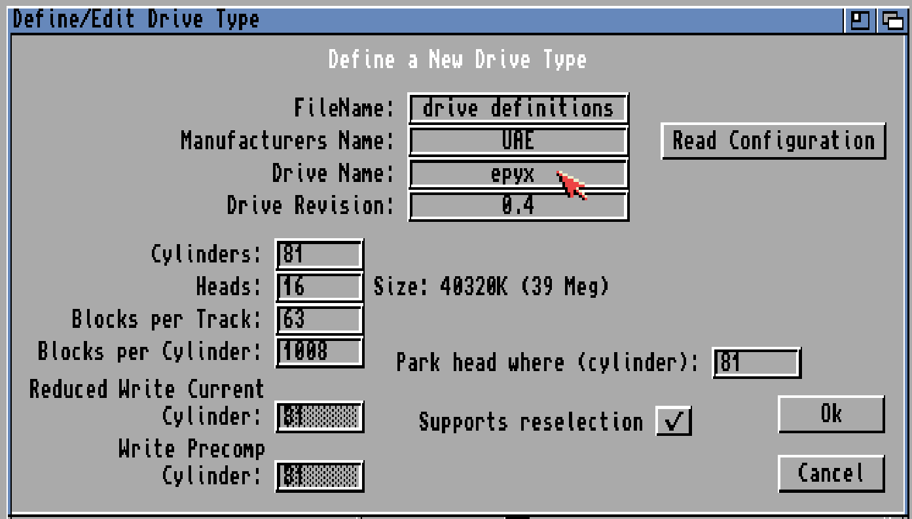

Start by clicking the `Read Configuration` button. A message box appears to indicate that most information will be inferred from the drive. Click `Continue` to read this information.


Change the "Drive Name" to be `epyx` for your Epyx specific harddisk. Click the `Ok` button and in the next dialog `Ok` again.


You should now see that the other buttons also became available.


Select the `epyx` drive and click the `Partition Drive` button.

The "Partitioning" dialog opens and shows existing partitions. 


Delete any existing partitions. Click the left side of the disk layout drawing at the top and move the triangle shaped slider at the bottom of it to the left. The size of the first partition should be around 5 MB, sufficient for the few files that will be stored.

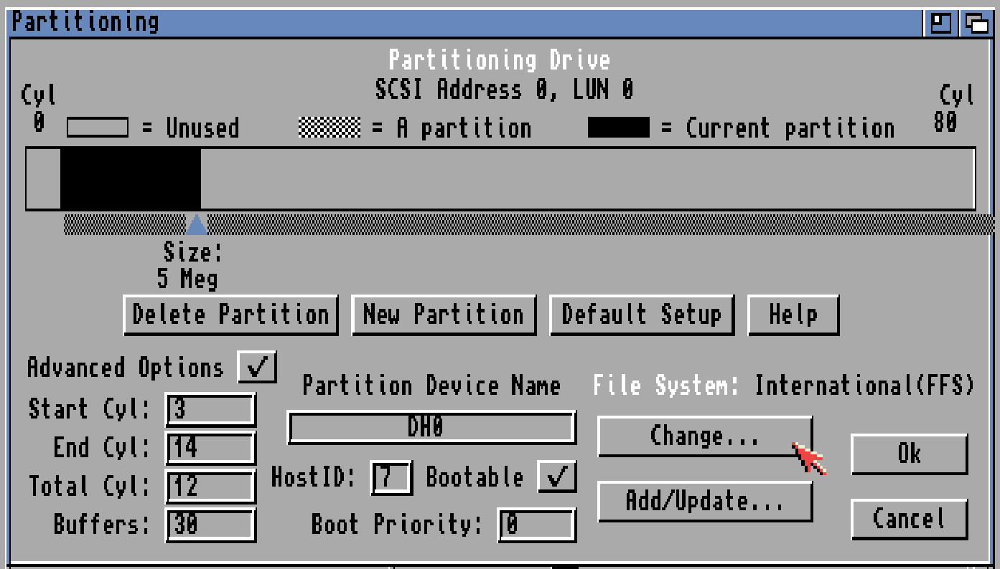

Change the "Partition Device Name" to `DH0` and select the "Bootable" and "Advanced Options" checkboxes. The dialog will show additional options including a button "Change..." to change the file system type. Click this button.


In the "File System Characteristics" dialog uncheck the "Fast File System" and "International Mode" checkboxes. Click on `Ok` to return to the "Partitioning" dialog.

Create another partition by clicking the "New Partition" button. Click to the right of the first 5 MB `DH0` partition in the black rectangle indicating the remaining space on the disk.


Set the "Partition Device Name" to be `DH0B` and change the file system to be "Fast File System" by unchecking the International Mode checkbox in the "File System Characteristics" dialog. In addition uncheck the `Auto-mounted this partition` to prevent automatic mounting of this partition as a drive. The startup script will take care of this later. Also, make sure that the drive is not marked as `Bootable`, since it should not be booted from. Click on `Ok` to commit all changes to the partitions.

Back in the main hard drive preparation dialog of the *HDToolBox* program you should see that the status of the epyx drive has changed to `Changed`. Finalize the partitions and the drive definition by clicking on the "Save Changes to Drive" button.

Start a new configuration for a Commodore Amiga 500 (or 2000 if you prefer) and add `epyx-handy16.hdf` as the sole hardfile. Insert the Workbench 1.3 diskette in `DF0` and boot the system.

Workbench 1.3 should open and show four drives on the desktop. 

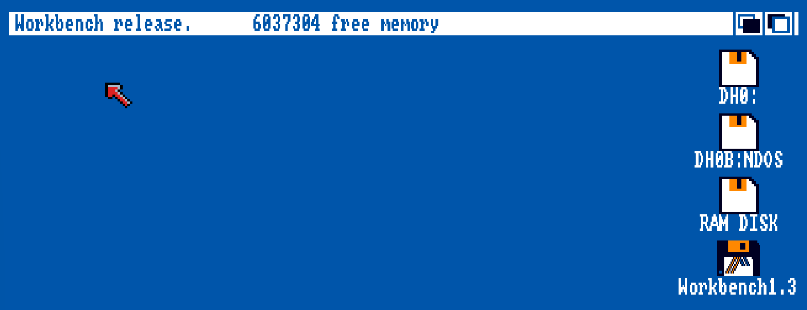


Two are called `DH0:` and `DH0B:NDOS`, which represent the two partitions created earlier. These need to be formatted, or "initialized" as it is called under Workbench 1.3.

Select `DH0:` and right-click to select `Intialize` from the `Disk` top menu. There will be a few dialogs, which you should confirm to start the initialization. 


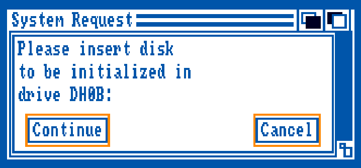
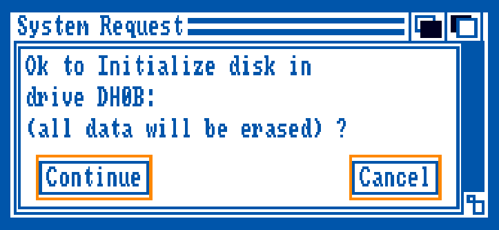
After a few seconds the name of the drive will change to `Empty`.

Assuring the drive is still selected, right-click to select `Rename` from the `Workbench` menu. Change the name to be `BootPart`.

Repeat this process for the other drive `DH0B:NDOS` to initialize it and rename the drive from `Empty` to `AmigaHD`.

## Installing Handy Development environment

Now that the partitions are made, the Handy backups for `DH0` and `DH0B`, or `BootPart` and `AmigaHD` can be restored.

Insert the `quarterback-50.adf` diskette into `DF1` and open the drawer.


Start the *Quarterback* program. First, select the `BootPart` drive to restore to. After selecting that drive, click on `Restore`.


On the next dialog with "Restore options" deselect drive `DF0` and select the option to "Restore empty drawers" and click `OK` to continue to the next dialog. 


You will get a prompt that the inserted diskette is not a backup set. 


Remove the Workbench 1.3 diskette from the drive and insert `handy-16-dh0.adf` instead. This is the backup set for the boot partition. It contains just enough to defer booting to the other partition `AmigaHD`.


Next, *Quarterback* will show all files in the backup set. Leave all files and folders checked. Click on `Start` to restore the backup.


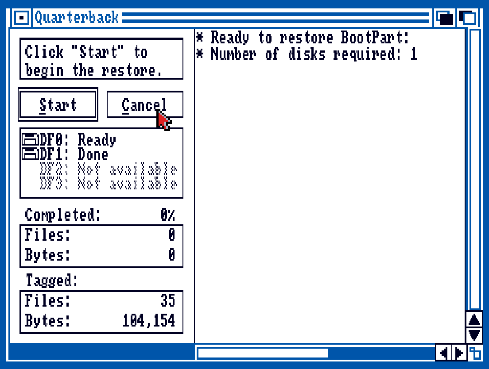

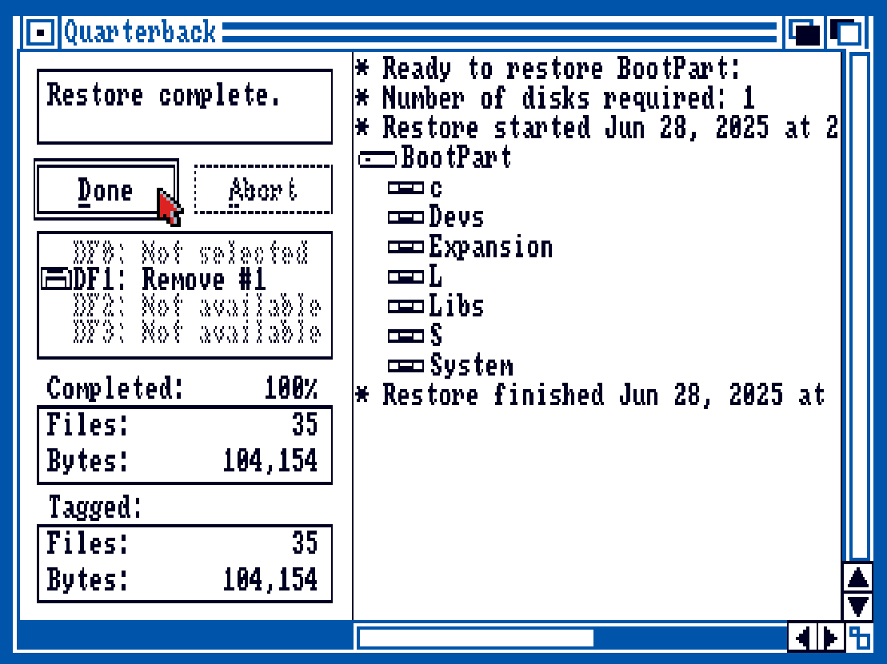
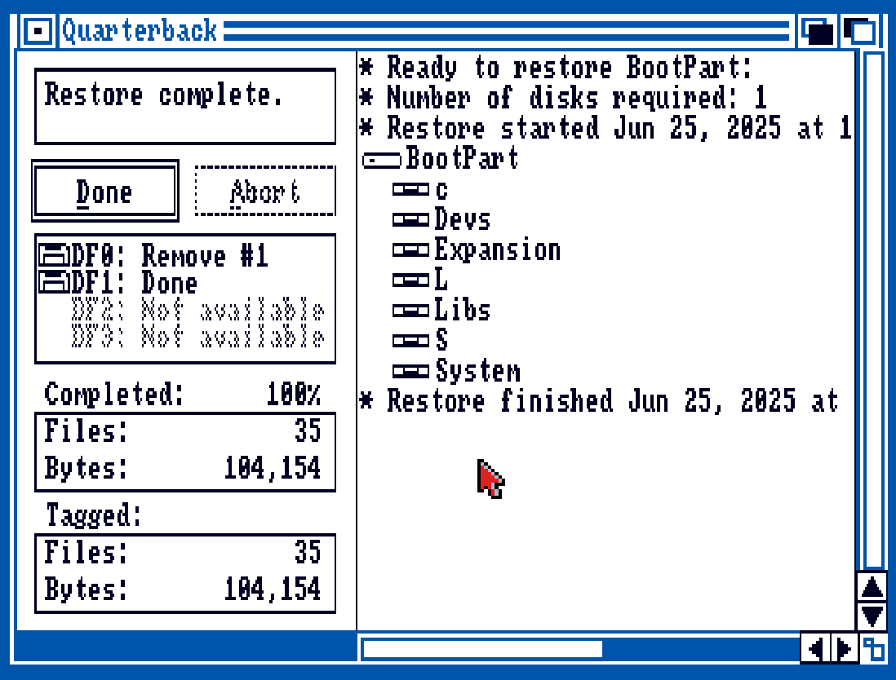

Eject the Quarterback backup disk handy-hd0.adf floppy from `DF1`. You can restart the emulator now if you want.
Open a new shell window with a CLI and change the current folder to `BootPart:`. 

``` 
cd BootPart:
dir l
```

You should see that the folder contains the following files:

```
Disk-Validator
FastFileSystem
Ram-Handler
vdk-handler
```


Similarly, ask for the directory contents of `devs`. Notice that there are two example `MountList` files available. Copy one of these files to a new file called `MountList`, which will be used during mounting of devices. Start editing the file with the `ed` editor found in the `SYS:` drive under the `c` folder.

```
cd devs
dir
copy MountList.ST225 MountList
SYS:c/ed MountList
```


The `ed` editor will open and show the contents of the `MountList` file. Scroll down to find an entry for the `VDK:` device using the `vdk-handler` from the `DH0:devs` folder.

```
VDK:	Handler = L:vdk-handler
		StackSize = 2000
		GlobVec = -1
		Priority = 5
#
```

Just above the `VDK:` entry you should also find the `DH0B:` entry. This is the device corresponding to the second partition of the hardfile, which has a partition with the same name `DH0B`. The entry needs to be changed based on the values of the actual drive.

```
DH0B:
    Device = uaehf.device
    FileSystem = l:FastFileSystem
    Unit   = 0
    Flags  = 0
    Surfaces  = 4
    BlocksPerTrack = 63
    Reserved = 2
    Interleave = 0
    LowCyl = 15  ;  HighCyl = 80
    Buffers = 30
    GlobVec = -1
    BufMemType = 1
    Mount = 1
    DosType = 0x444F5301
    StackSize = 4000
#
```

```
mount DH0B:
format drive DH0B name AmigaHD FFS NOICONS
```

Surfaces: 4
Sectors: 63
Cylinders: 325
Block size:512

4MB disk OFS:
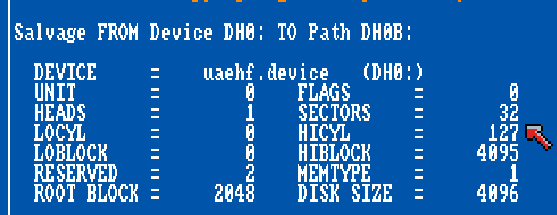

40MB disk OFS:
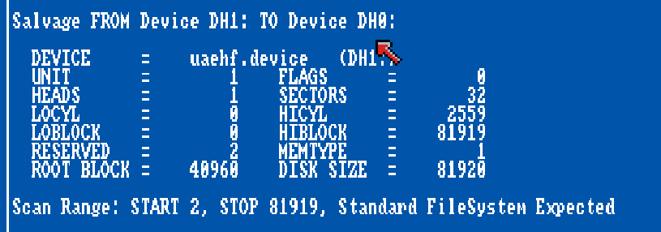

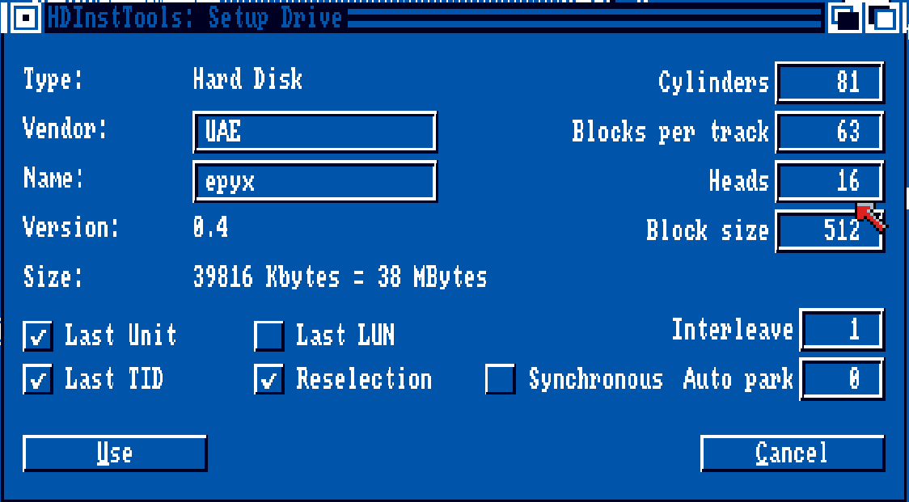

DIsk 20MB with FFS (international)

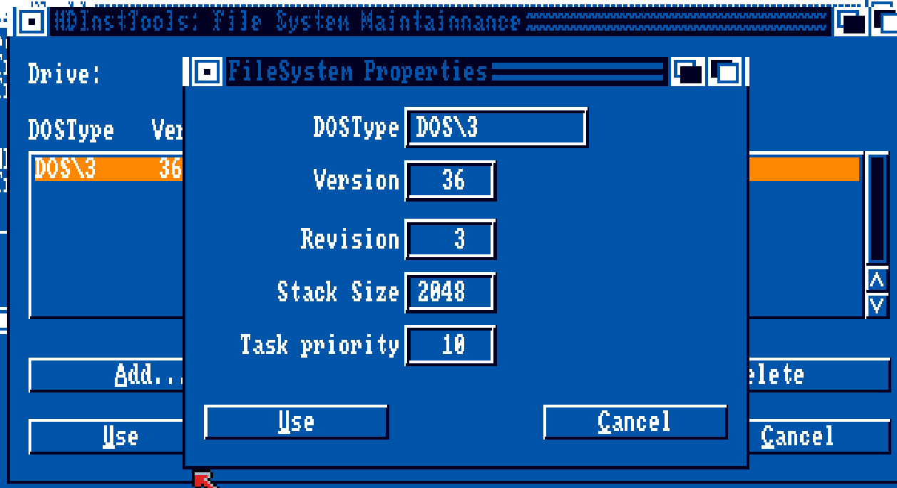

FastFileSystem 12248 bytes 36.3  DOS\3
FastFileSystem 12204 bytes 34.85 DOS\3

Stacksize 2048
Task priority 10


Cylinders 2560
Heads 1
Blocks per track 32
Blocks per cylinder 32
Size 40944 K (39M)


Partition one
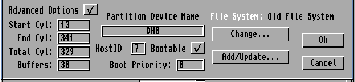

Maxtransfer is 0x1FE00

### Second partition
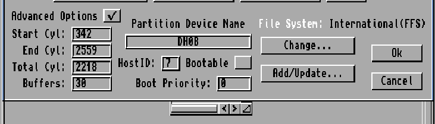


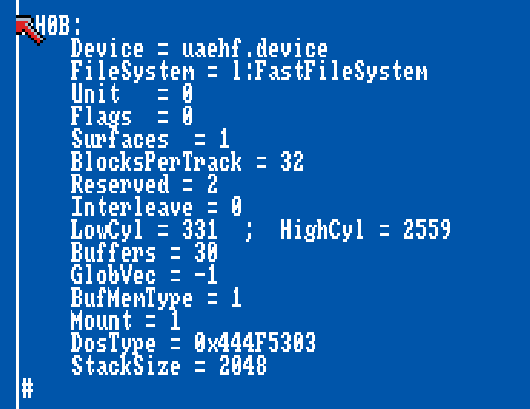

330
n

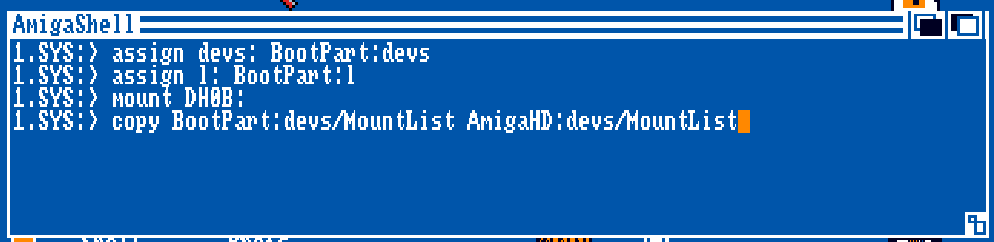