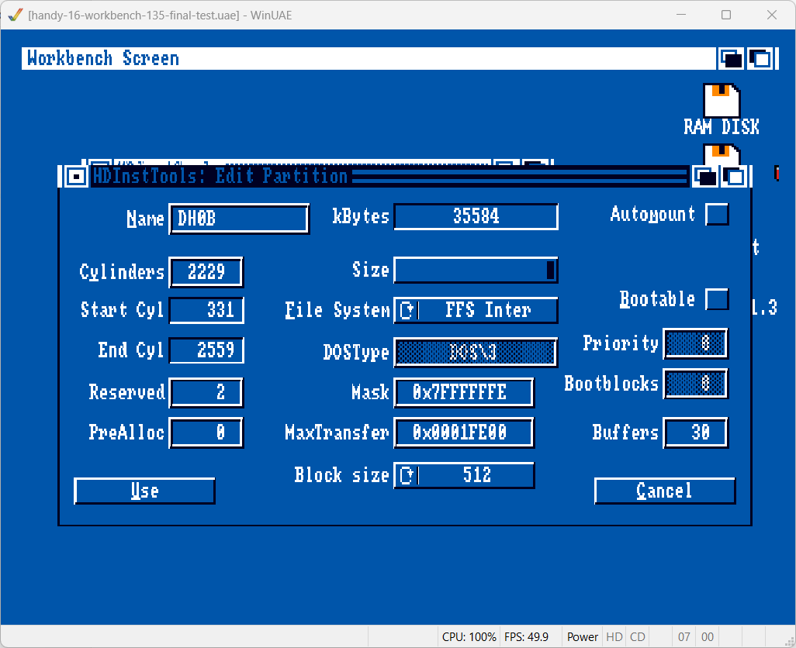
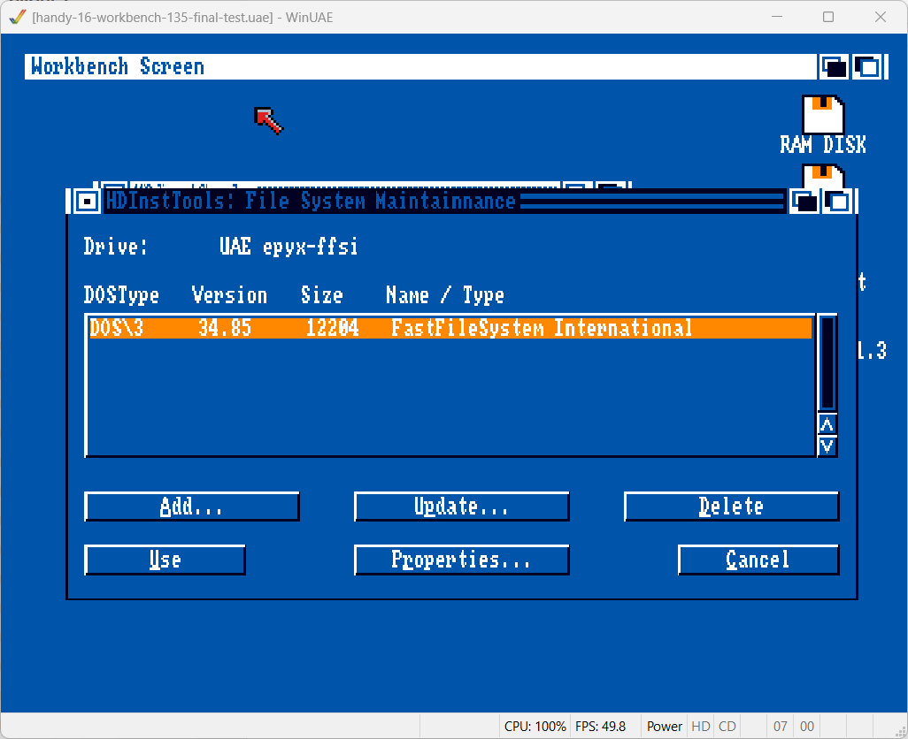
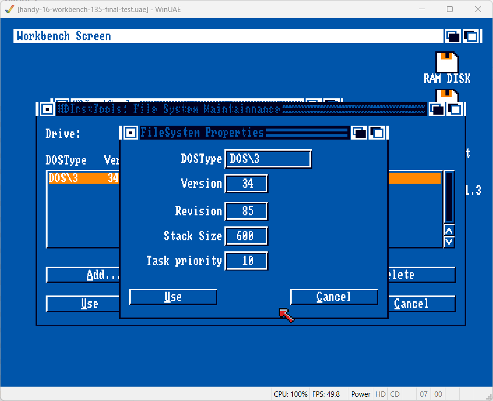
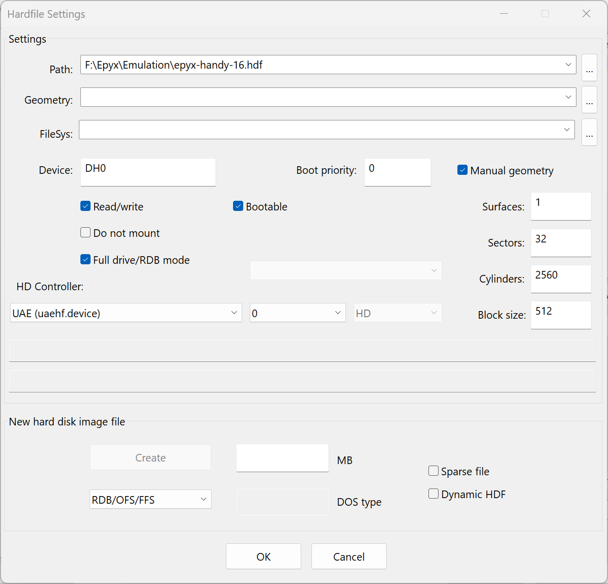
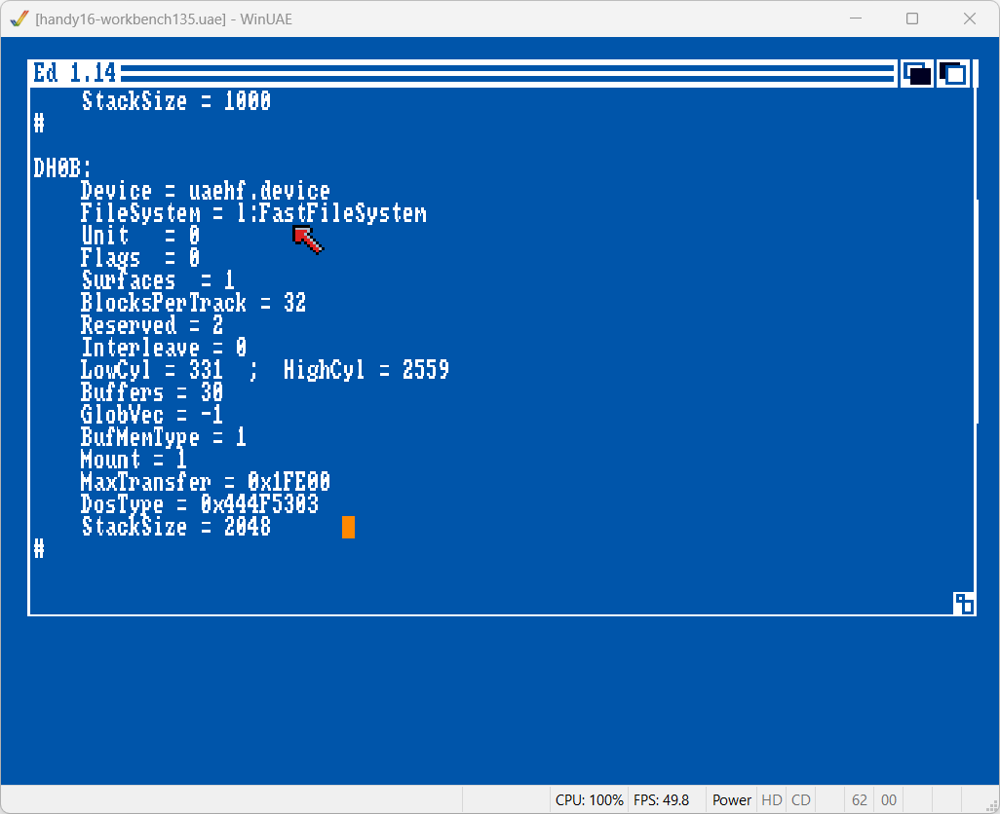
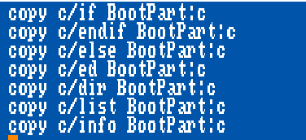
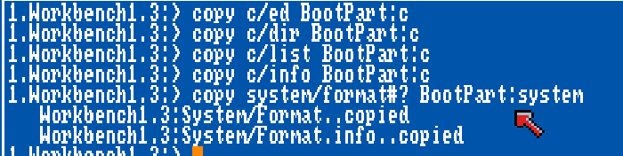

Partition 1:


Partition 2:


Filesystem:



Start partitioning311.uae
Enter DH0
Click Full drive/RDB mode. then Manual geometry, then Full drive/RDB again
Make sure device 0, even after clicking OK. Drag to top.

Boot with DF0:Workbench3.1, DF1:handy-16-boot
in Shell 

```
makedir "Ram Disk:l"
copy V1.3Boot:l/FastFileSystem "Ram Disk:l"
assign l: "Ram Disk:l"
dir l:
; Should read just FastFileSystem
``` 

Replace DF1:Install3.1

Open HDToolBox. select drive 0,
go to drive types, delete all, Create new and read configuration, ok

Partition drive, click right side, delete partition
Set End Cyl to 330, DH0, change file system to OFS (uncheck FFS and international)
New partition DH0B, check Add/Update
Change file system to not automount, MaxTransfer to 0x1fe00

Save changes to drive, quit emulator

New emulator for A500
DF0:Workbench1.3
Add hdf file 


```
format drive dh0 name BootPart NOICONS
```

Restore hd0 with Quarterback

cd BootPart:devs
copy MountList.ST251 MountList
sys:c/ed MountList



write with esc, x





